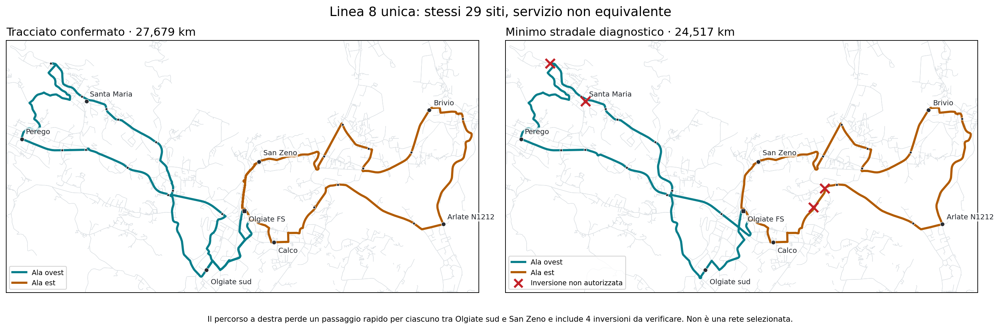

# Linea 8 — quanto si risparmia liberando gli accessi delle ali?

## Esito

Sulla rete stradale RT017 congelata, il minimo di distanza con **tutti i 29 siti di progetto** (inclusa la nuova ipotesi Arlate N1212) e un solo ritorno a Olgiate FS per ala è **24,517 km per giro completo**. Il tracciato confermato è **27,679 km**. Il risparmio teorico è dunque **3,161 km**, ma **non è un risparmio di servizio equivalente**: Olgiate sud e San Zeno perdono ciascuno uno dei due passaggi che consentivano di raggiungere rapidamente la stazione *in entrambi i versi*.

| Ala | Tracciato confermato | Minimo stradale | Risparmio |
|---|---:|---:|---:|
| Ovest | 14,163 km | 12,624 km | 1,539 km |
| Est | 13,516 km | 11,894 km | 1,622 km |
| Giro completo | 27,679 km | 24,517 km | 3,161 km |

Questo **non è un percorso nuovo**: i due cammini risultanti coincidono arco per arco con `west_A` ed `east_A` già registrati in `independent_wings.json`. Il presente controllo ne verifica il minimo di distanza in un dominio stradale più esplicito: ordine libero dei siti, accessi alle ali non congelati, stato dell'arco entrante conservato, nessun ritorno intermedio a FS. Arlate N1212 viene incontrata sul cammino est esistente, senza nuovi chilometri. La giunzione a FS supera soltanto le restrizioni via-node rappresentate.

## Il risparmio non conserva la prestazione locale

I tempi qui sotto sono **sola marcia modellata, senza sosta, attesa o cammino**. Per ciascun sito si prende la migliore occorrenza realmente presente nel giro, senza fondere posizioni/eventi diversi.

| Sito | Occorrenze prima → dopo | FS → sito prima → dopo | Sito → FS prima → dopo |
|---|---:|---:|---:|
| Olgiate sud | 2 → 1 | 3,92 → **21,72 min** | 3,76 → 3,76 min |
| San Zeno / Via Cantù | 2 → 1 | 2,31 → 2,31 min | 2,38 → **23,41 min** |

Quindi `stop_identity_present=true` in entrambi i casi **non implica** che l'accesso ferroviario rapido sia conservato. La garanzia richiesta è almeno per occorrenza direzionale e per evento di servizio ordinato, non solo per identità di fermata. Il minimo stradale fallisce questo controllo. Non viene trasformato in una proposta Linea 8.

Inoltre il cammino minimo contiene **quattro inversioni immediate**; nessuna è autorizzata come manovra autobus. Anche il tracciato confermato conserva manovre da validare: il confronto non certifica nessuno dei due come esercibile.

## Cosa significa per km e orario

Per fare 18 giri completi entro la stessa produzione annua del caso confermato a 16 giri, servirebbe un giro di massimo **24,603 km**. Questo minimo stradale sta appena **86 metri per giro** sotto quel valore. Con 18 giri e 260 giorni ipotetici darebbe **114.741 km/anno**, comunque **3.322 km sopra 111.419**; non comprende il deposito. È un limite di distanza, **non** un orario H30/H60 costruito e non un impegno di budget.

Il numero 114.741 km era già nel repository come limite inferiore del confronto `flexible_peak_km_floor.json`. La novità dell'audit non è una soluzione: è rendere verificabile **perché** la combinazione geometrica più corta non soddisfa la promessa locale di Olgiate sud e San Zeno, pur mantenendo tutte le identità di fermata.

Il tracciato confermato resta la base di lavoro. `network_selected=false`, `primary_selection_authorised=false`, `runner_up_selection_authorised=false`. Restano non certificati restrizioni dipendenti dall'intera storia del cammino, manovre, paline/salite, continuità passeggeri alle FS, orario effettivo, coincidenze, mezzi e deposito. Nessuna probabilità empirica di coincidenza o beneficio GJT pesato sulla domanda viene inferita.

Evidenza riproducibile: [`free_boundary_road_comparison.json`](../outputs/phase2/rt031_line8_local_shortcuts_v3/free_boundary_road_comparison.json), [`free_boundary_road_comparison.geojson`](../outputs/phase2/rt031_line8_local_shortcuts_v3/free_boundary_road_comparison.geojson), `scripts/phase2_probe_rt031_line8_free_boundaries_v3.py`, `scripts/phase2_render_rt031_line8_free_boundaries_v3.py`. Gli hash degli input RT017/RT022/successor devono coincidere con l'audit `free_order_road_comparison.json` prima di ricalcolare.
