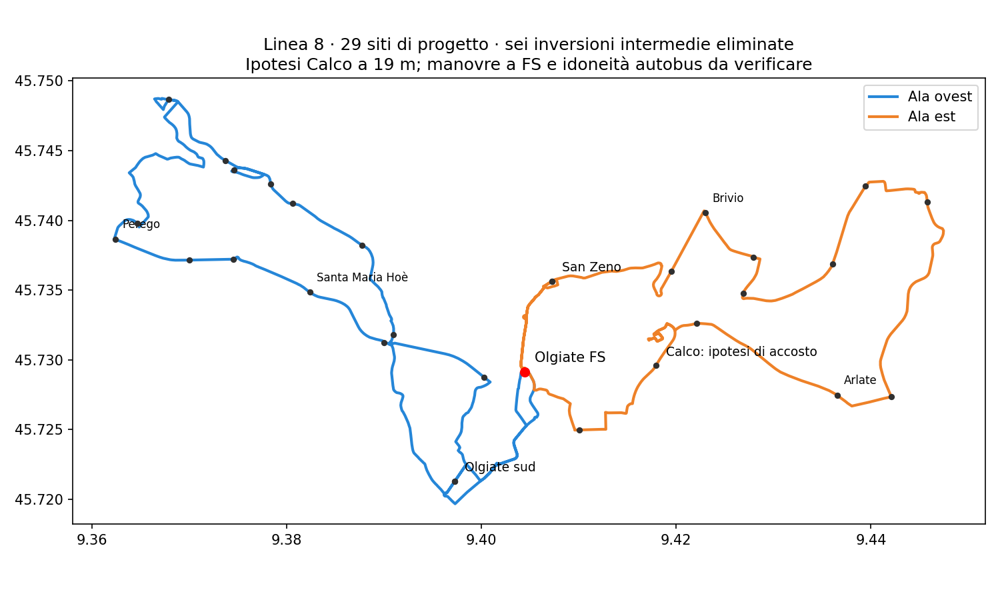

# Linea 8 — attraversamento di Calco e percorso senza le sei inversioni intermedie

**Confronto successivo:** la [ricerca degli ordini e della sola esclusione Hoè](RT031_LINEA8_COMPROMESSO_HOE_V3.md) riduce a 121.799 km la soluzione con tutti i siti e trova una variante da 115.131 km con la sola Hoè esclusa. La perdita di copertura di Santa Maria Hoè è misurata e la scelta rimane aperta.

La ricerca trova una **nuova ipotesi completa di tracciato e orario**: 29 siti di progetto inclusa FS, 16 giri interi sulla medesima linea, due occorrenze direzionali per Olgiate sud e San Zeno, nessuna delle sei inversioni immediate intermedie. A Calco serve un'ipotesi di accosto **18,88 metri dal nodo stradale attuale**, sul nodo `n:532517.86:5064089.42` del ramo di servizio collegato a Via Nazionale. È un'ipotesi di posizione stradale, non uno spostamento di palina autorizzato né una misura della distanza pedonale.

| Confronto su 16 giri × 260 giorni | Lunghezza giro | Km annui | Scostamento da 111.419 |
|---|---:|---:|---:|
| Geometria originale, sei manovre da verificare | 27,679 km | 115.143 | +3,34% |
| Cinque ritorni aggiunti, Calco ancora irrisolta | 30,435 km | 126.611 | +13,64% |
| Percorso ricostruito, accosto Calco ipotizzato | **29,667 km** | **123.413** | **+10,76%** |

L'ultima riga risparmia **3.198 km/anno** rispetto al pacchetto precedente e risolve nel modello anche Calco, ma costa **8.270 km/anno più della base accettata**. Questo maggiore costo non è autorizzato. I 260 giorni sono ancora un calendario di confronto, non un calendario finanziato.

È stato verificato anche il possibile risparmio di un giro, senza adottarlo: **15 giri con limiti di spalla H70, H75 o H80 sono tutti infeasible** nel medesimo dominio, mantenendo H30 sui gruppi ferroviari e H120 10–16. Ridurre il conteggio da 16 a 15 non fornisce quindi un orario ammissibile in queste tre prove; non è una prova universale per altri domini o preferenze.

## Come è stato verificato il punto di Calco

Il ritorno locale al nodo originale non è disponibile. Neppure un percorso di attraversamento da dopo Arlate/Madonnina a prima di Calco/Via Virgilio, mantenendo il punto di servizio originale, evita tutte le inversioni immediate: falliscono sia il test che impone il vecchio arco in ingresso a Calco sia quello che ammette altri ingressi.

Sono stati quindi confrontati **tutti i nodi della componente degli archi `highway=service` contenente il punto originale**, comprese le giunzioni con le altre strade. Nessun raggio scelto per ottenere un risultato. Solo il nodo a 18,88 m permette un attraversamento nel dominio dichiarato. La ricerca non aggiunge una fermata e non elimina l'identità inventariale di Calco: propone un diverso evento di accosto per quella identità. **La conservazione della copertura pedonale e del lato fisico della palina non è certificata**.

## Ricostruzione delle due ali

Il confronto finale ricalcola l'intera ala ovest e l'intera ala est, conservando l'ordine di tutti gli eventi passeggeri originali e gli archi di partenza/arrivo a FS. Impone anche l'arco originale in ingresso per **entrambe** le occorrenze di Olgiate sud e San Zeno: non basta conservare soltanto il nome della fermata. Solo Calco usa la posizione ipotizzata dichiarata sopra. Gli attraversamenti geometrici supplementari di punti di fermata non diventano automaticamente eventi passeggeri.

Il risultato è il minimo di distanza **nell'ordine di servizio e nei confini dichiarati**, su grafo congelato con restrizioni via-node rappresentate e divieto di inversioni immediate nelle ali. Non è il minimo globale fra tutti gli ordini di fermata o tutte le strade possibili. Non certifica restrizioni dipendenti dalla storia completa, sagoma del mezzo, sicurezza dell'accosto o manovra a FS: la stazione resta una verifica fisica separata.

I passaggi rapidi nominali (marcia ×1,1, sosta 0,5 min) sono:

| Zona | Da FS, prima occorrenza utile | Verso FS, ultima occorrenza utile |
|---|---:|---:|
| Olgiate sud | 4,32 min | 4,61 min |
| San Zeno/Via Cantù | 2,54 min | 2,91 min |

Sono tempi modellati senza osservazioni sul campo. Non sono nuove percentuali di copertura o probabilità di coincidenza.

## Orario di confronto ricostruito

Il solutore trova **16 giri completi**, prima ovest, con cinque corse H30 abbinate a treni reali datati per ciascuna ala/punta, limite di attesa utile di 70 minuti nelle spalle e 120 minuti nella morbida 10–16. Il limite riguarda persone pronte nelle finestre del confronto 06:45–19:40, non ogni intervallo tra passaggi al confine delle fasce.

| Giro | FS verso ovest | FS intermedia verso est |
|---:|---|---|
| 1 | 06:00 | 07:00 |
| 2 | 06:30 | 07:30 |
| 3 | 07:00 | 08:00 |
| 4 | 07:30 | 08:30 |
| 5 | 08:00 | 09:00 |
| 6 | 09:10 | 10:05 |
| 7 | 10:20 | 11:20 |
| 8 | 12:20 | 13:20 |
| 9 | 14:20 | 15:20 |
| 10 | 15:35 | 16:30 |
| 11 | 16:40 | 17:40 |
| 12 | 17:10 | 18:10 |
| 13 | 17:40 | 18:40 |
| 14 | 18:10 | 19:10 |
| 15 | 18:40 | 19:40 |
| 16 | 19:40 | 20:35 |

L'ultimo rientro a FS è circa **21:18 nominali**. La sosta intermedia massima è circa **15,9 minuti**. Quattro mezzi bastano in 24 dei 27 scenari deterministici di marcia/sosta/recupero, cinque nei restanti tre; quattro nel caso nominale. Gli abbinamenti H30 sono ovest→Milano 06:56–08:56, est→Milano 07:56–09:56, ovest←Milano 16:32–18:32, est←Milano 17:32–19:32. Rimangono compatibili 18 dei 22 precedenti obiettivi ferroviari. Non è un orario al pubblico o una disponibilità di flotta approvata.

## Stato della proposta

Ora esiste un'alternativa stradale completa che elimina le sei inversioni intermedie senza perdere i due passaggi locali utili. **Non viene sostituita automaticamente alla base da 115.143 km**: l'ipotesi di accosto a Calco, la verifica pedonale, l'idoneità delle strade al mezzo e i maggiori km devono essere risolti prima dell'adozione. La verifica fisica delle manovre originali può ancora permettere di mantenere la base meno costosa; il nuovo tracciato è una soluzione di confronto pronta da esaminare.

`network_selected=false`, `primary_selection_authorised=false`, `runner_up_selection_authorised=false`. Nessun valore viene scelto per `decision_budget_km` o `uncertainty_band_min`.

[Risultati e orari machine-readable (JSON gzip)](../outputs/phase2/rt031_line8_local_shortcuts_v3/calco_through_path.json.gz) · [Tracciato GeoJSON](../outputs/phase2/rt031_line8_local_shortcuts_v3/calco_through_path.geojson) · [Confronto precedente](RT031_LINEA8_MANOVRE_ALTERNATIVE_STRADALI_V3.md)
