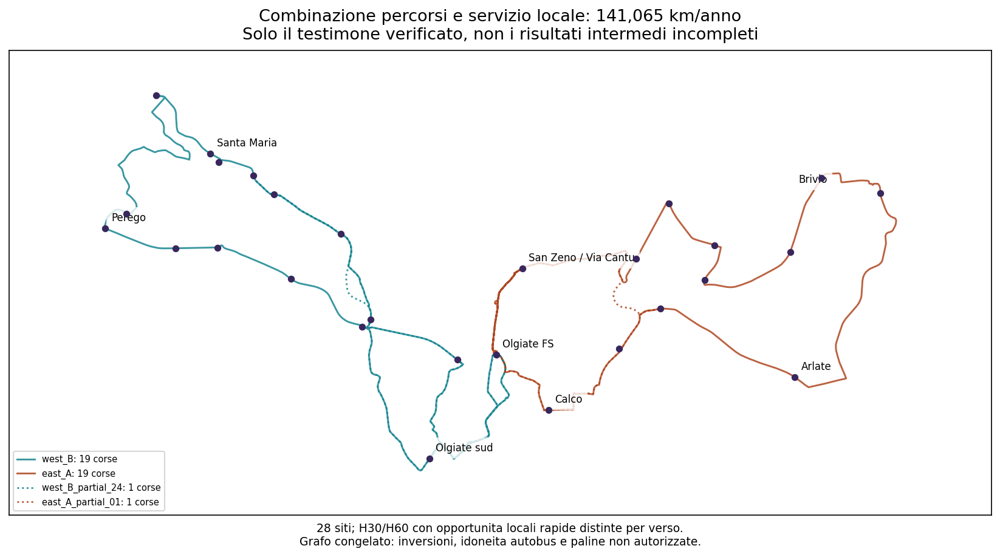

# Linea 8 — combinare percorsi originali, corretti e corse locali

## Risultato concreto

**Nessun nuovo risparmio verificato.** Il miglior orario completo rimane a **141.064,938 km/anno**, +26,61% sui 111.419 di riferimento. Non e una proposta economicamente chiusa.

Abbiamo ampliato il confronto da 64 a **68 percorsi**: alle ali corrette e alle corse parziali aggiungiamo le quattro ali originali, piu corte ma con viaggio locale lento in un verso. Il solver puo combinarle liberamente, senza trasferimenti passeggeri inventati.

Il nuovo **limite inferiore e 137.813,779 km/anno**, +23,69% sul riferimento. Quindi, anche chiudendo perfettamente questa ricerca, il risparmio aggiuntivo non puo superare **3.251,159 km/anno** rispetto al testimone corrente. Non basta per recuperare i 29.645,938 km mancanti.

**137.814 non e il costo di un orario trovato**: e un limite inferiore. La ricerca non ha dimostrato il minimo esatto nei 68 percorsi. I risultati intermedi con lacune non sono promossi a proposte. Questo esclude i 111.419 soltanto nel dominio dichiarato, non in tutte le reti possibili.

## Nessun trucco sui viaggi locali

Per ogni percorso, Olgiate sud e San Zeno hanno autorizzazioni di conteggio separate **verso FS** e **da FS**. Una direzione conta per H30/H60 e per i collegamenti ferroviari soltanto se il suo tempo sul bus non supera l'inviluppo dei viaggi locali rapidi del riferimento in **tutti i nove scenari** di marcia/sosta. E un confronto tecnico con il riferimento, non una nuova soglia politica di minuti.

| Percorso originale | Direzione locale rapida conteggiabile | Direzione non conteggiata come rapida |
|---|---|---|
| Ovest A | Olgiate sud → FS | FS → Olgiate sud |
| Ovest B | FS → Olgiate sud | Olgiate sud → FS |
| Est A | FS → San Zeno | San Zeno → FS |
| Est B | San Zeno → FS | FS → San Zeno |

Il solver verifica nuovamente questi tempi: non si fida soltanto dell'etichetta di idoneita. Gli eventi delle ali originali, che avevano indici riferiti all'intero otto, sono ricostruiti sulle singole sequenze stradali effettive.

Rimangono invariati: 28 siti, H30 nelle due punte/H60 nel resto, fascia passeggeri 06:30–19:40, 260 giorni ipotizzati, 297 controlli ferroviari per sito sul giorno congelato, quattro mezzi nominali e 49 combinazioni di fase. Il testimone ancora migliore usa quattro mezzi nominali/fino a sei nello stress. Questi non sono dati osservati di affidabilita.

## Conseguenza per il progetto

Non ha senso aspettarsi che il solo incastro delle geometrie gia disponibili trasformi +26% in un piccolo sforamento. Il risultato delimita il margine di questa pista senza imporre tagli.

La direzione da esplorare per un risparmio maggiore e un dominio fisico diverso: punti di fermata e percorsi valutati sulla **copertura pedonale effettiva**, non sull'obbligo di conservare tutte le identita attuali. Le prove precedenti sui tagli non autorizzano perdite territoriali importanti; nessun nuovo taglio e adottato qui. Anche le sei manovre individuate restano da validare: questo confronto non le risolve e non autorizza il tracciato.

`decision_budget_km=null`, `uncertainty_band_min=null`, `total_operating_km=null`; `network_selected=false`, `primary_selection_authorised=false`, `runner_up_selection_authorised=false`. I km sono di servizio, prima di deposito e riposizionamenti.

## Artefatti e riproduzione

- `scripts/phase2_compare_rt031_line8_mixed_local_v3.py --graph_dir <grafo congelato> --time_limit 180 --checkpoint <file locale>`; il checkpoint rigenera i vincoli dalle tracce, non riutilizza coefficienti opachi.
- `outputs/phase2/rt031_line8_local_shortcuts_v3/mixed_local_comparison.json`: famiglia, qualificazione per direzione/scenario, orario verificato, limite inferiore e stato non ottimo.
- GeoJSON/PNG omonimi: esclusivamente i percorsi del testimone completo, non un insieme di candidati presentato come linea unica.
- `tests/test_phase2_rt031_line8_mixed_local_v3.py`: direzioni non intercambiabili, rifiuto delle false etichette rapide, ricalcolo dell'idoneita, degli orari e degli obiettivi ferroviari, nessuna selezione.
