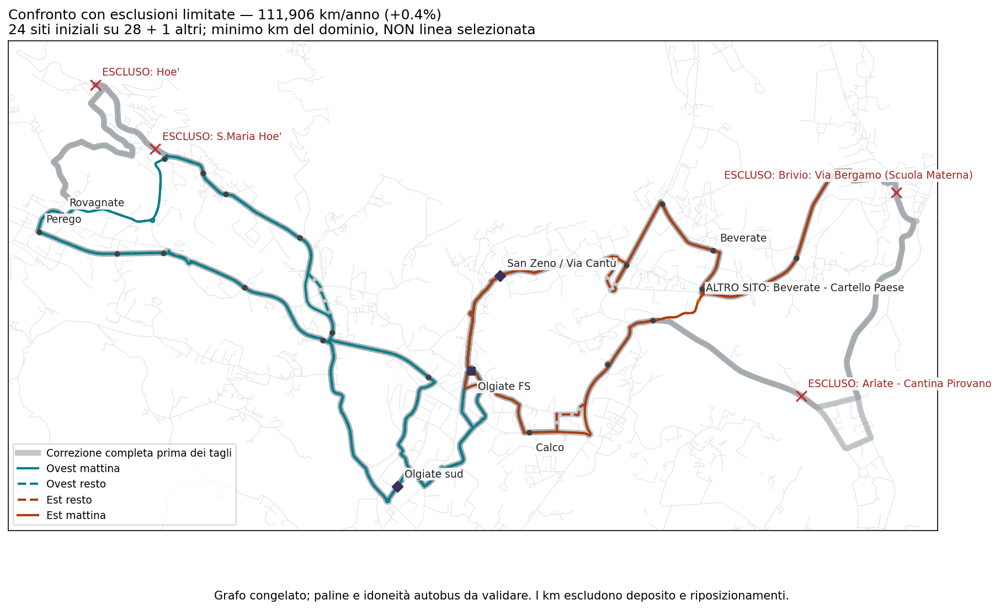

# Linea 8 — vicini ai 111 mila km, ma con quali rinunce?

## Risultato

**Un confronto scende a 111.905,847 km/anno di servizio, appena 486,847 km (+0,44%) sopra 111.419, conservando i collegamenti locali brevi nei due versi. Non è però una soluzione soddisfacente a tutti i requisiti: perde molta copertura a Brivio e Calco.** Non viene adottato né presentato come proposta finale.

È il minimo chilometrico di un dominio esplicito di **616 combinazioni**, non della rete stradale intera. Il confronto lascia omettere fino a due siti consecutivi per ala dall'ordine obbligatorio; un sito omesso ma ancora attraversato resta conteggiato. Include anche nove altri siti d'inventario convenzionale, collegati al grafo e supportati dalla matrice pedonale, quando il nuovo tracciato li incontra. Non inventa nuove paline lungo le strade.

Conservare le fermate è qui una preferenza, non un vincolo assoluto. Restano obbligatori i passaggi locali iniziali/finali di Olgiate sud e San Zeno in questo dominio, per non recuperare km reintroducendo di nascosto i 31–32 minuti.

## Che cosa cambia nel confronto vicino al budget

Il caso `west_21+east_15` conserva **24 dei 28 siti iniziali** e incontra anche **Beverate – Cartello Paese**, già nell'inventario: **25 siti ipoteticamente serviti, FS inclusa**. Sono identità/siti, non un conteggio di paline direzionali autorizzate.

I quattro siti iniziali non più incontrati sono:

- Arlate – Cantina Pirovano (`ASF::ARLATE_CANTINA_PIROVANO`).
- Brivio – Via Bergamo / Scuola Materna (`FROZEN::300063`).
- S. Maria Hoè (`FROZEN::300782`).
- Hoè (`FROZEN::300873`).

Non basta dire «sono soltanto quattro fermate»: cambia l'accesso delle persone alle fermate rimaste.

| Comune | Accesso potenziale entro 10 min a piedi, riferimento completo | Confronto 111.906 km | Variazione in punti percentuali |
|---|---:|---:|---:|
| Brivio | 89,09% | 69,40% | −19,69 |
| Calco | 68,21% | 56,13% | −12,08 |
| Olgiate Molgora | 84,56% | 84,56% | 0 |
| Santa Maria Hoè | 95,75% | 91,89% | −3,86 |
| La Valletta Brianza | 67,85% | 67,84% | −0,004 |
| Totale cinque comuni | 79,16% | 72,18% | −6,98 |

Il conteggio comprende il sito aggiuntivo di Beverate: non è una perdita gonfiata ignorando quella possibilità. Si conserva la popolazione/pesatura territoriale della matrice congelata e si riproduce esattamente il riferimento completo. **Non sono utenti previsti, domanda di trasporto, viaggi serviti o probabilità di coincidenza.** Entrambi i siti locali nuovi e tutte le occorrenze d'imbarco restano ipotetici.

Anche le soglie 5 e 8 minuti sono conservate separatamente per ogni comune. Per esempio Santa Maria Hoè perde **16,25 punti a 5 minuti**, non soltanto i 3,86 della colonna a 10 minuti; Brivio perde **25,43 punti a 8 minuti**. La tabella sintetica non autorizza a ignorare queste rinunce.

## Controllo operativo del caso vicino al budget

Si usano le stesse **36 corse** del confronto completo corretto: cinque partenze ogni 30 minuti nei gruppi di punta, le altre corse conservate, prima partenza ovest 06:33. Calendario di 260 giorni ipotetici; deposito e riposizionamenti esclusi. La fascia rimane quella di circa 12 ore, non il servizio 06–22 né 13–14 ore.

- Olgiate sud e San Zeno mantengono i viaggi locali modellati di circa **4 e 3 minuti** nei due versi.
- Intervalli H60 aggregati per identità e obiettivi ferroviari mattutini congelati **07:26–09:26** passano nei 27 scenari. Margine residuo minimo dopo tre minuti di cammino: circa **6,9 minuti**.
- Nel caso +10% marcia / 30 secondi sosta servono **quattro mezzi**, con recuperi di 5/10/15 minuti; alcuni stress richiedono **cinque**.
- Sono controlli deterministici, non un'affidabilità osservata. Cinque corse H30 non certificano due ore comuni H30 per ogni passeggero in ogni direzione. Fermate fisiche, restrizioni dipendenti dalla storia, manovre, calendario ferroviario vigente e turni completi rimangono aperti.

Il minor numero di km migliora il quadro operativo, ma non compensa automaticamente la perdita territoriale. Nessun punteggio ponderato viene usato per farlo apparire vincitore.

## Perché non separare semplicemente i quartieri in servizi brevi?

È stato verificato anche questo, non solo suggerito. Le due ali esterne conservano i nodi d'inventario rimanenti; Olgiate sud e San Zeno vengono affidati a circuiti brevi espliciti, separati oppure congiunti in entrambi gli ordini e con due fasi orarie ereditate.

I **nove confronti** risultano fra **130.497 e 132.211 km/anno**. Richiedono 54 o 72 corse di componente, anziché le 36 originarie, e fino a 7–8 mezzi negli stress dei calendari esaminati. Ogni rientro a FS riceve il recupero dichiarato: non si nascondono corse o soste gratuite.

Alcune relazioni quartiere–territori, prima possibili su una singola corsa ipotetica, richiederebbero ora un trasferimento a FS. Le coppie perse sono elencate, senza convertirle in quantità di passeggeri. Non è un miglioramento evidente rispetto alla linea integrata; non è neppure una prova che ogni diversa organizzazione dei servizi brevi debba fallire.

## Che cosa possiamo concludere, e che cosa no

Nel dominio delle piccole esclusioni, **nessuno dei 616 confronti scende sotto 111.419 km**. Il più vicino (+0,44%) sacrifica parecchia copertura. Il minimo con tutte le 15 misure comunali 5/8/10 minuti almeno pari al riferimento resta **130.567 km**. Esistono punti intermedi: sono mantenuti tutti, con set di fermate conservate e ciascuna metrica territoriale separata.

I 616 sono combinazioni di vincoli, includono testimoni fisicamente equivalenti e non sono 616 proposte distinte. La frontiera stradale/accessibilità è preliminare: non include ogni dimensione operativa e non viene usata per cancellare gli altri casi. I controlli di orario completi riguardano il riferimento e il minimo chilometrico, oltre a eventuali casi entro il tetto (qui assenti).

Questo risultato **non dimostra l'impossibilità globale** di una proposta migliore: non esaurisce riordini, sostituzioni esplicite con altre fermate, nuovi siti sicuri lungo i percorsi o altre strutture di rete. Dimostra che il caso da 111.906 km non soddisfa la richiesta di un calo territoriale contenuto. Non lo si può chiudere come successo limitandosi a guardare i km.

## Artefatti

- [Tutte le combinazioni, coperture esatte e controlli](../outputs/phase2/rt031_line8_local_shortcuts_v3/retention_tradeoffs.json).
- [Tracciati GeoJSON dei testimoni controllati](../outputs/phase2/rt031_line8_local_shortcuts_v3/retention_tradeoffs.geojson).
- [Confronti con servizi locali separati](../outputs/phase2/rt031_line8_local_shortcuts_v3/local_split.json).
- Generatori: `scripts/phase2_probe_rt031_line8_retention_tradeoffs_v3.py` e `scripts/phase2_probe_rt031_line8_local_split_v3.py`. Sorgenti stradali e pedonali controllate per hash; CI configurata per ricostruzione byte per byte.

`network_selected=false`; `primary_selection_authorised=false`; `runner_up_selection_authorised=false`; `decision_budget_km=null`; `uncertainty_band_min=null`. Nessun nuovo tetto o calo accettabile di copertura è stato scelto al posto dell'utente.
