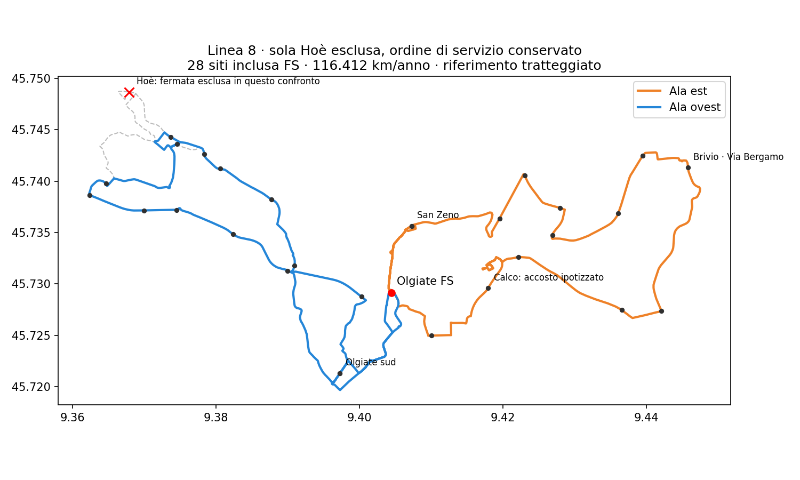

# Linea 8 — confronto concreto con la sola fermata Hoè esclusa

Il confronto progettualmente più prudente è **116.411,944 km/anno** su 260 giorni ipotizzati: conserva l'ordine di servizio del riferimento senza inversioni e **nessun tempo nominale FS↔fermata rimasta peggiora**. È **+4,48%** rispetto a 111.419 e circa 1.269 km sopra lo scenario da 115.143,267 già accettato: questo aumento ulteriore non è approvato. Mantiene 16 giri completi della stessa linea, H30 agganciato ai gruppi ferroviari del dataset e 28 siti di progetto inclusa FS, incluse le due occorrenze utili di Olgiate sud e San Zeno e Arlate N1212. Esclude soltanto `FROZEN::300873`, la fermata **Hoè**, e mantiene l'ipotesi di accosto Calco a 19 metri. La scelta non è adottata: la perdita territoriale va valutata esplicitamente.

Il minimo di distanza con ordine interno libero arriva a **115.130,637 km/anno** (+3,33%), ma peggiora alcuni viaggi fino a circa 19 minuti. Non viene raccomandato automaticamente per il solo rispetto del confronto chilometrico. Spendere 1.281,306 km/anno in più permette, in questi due testimoni, di conservare l'ordine e i tempi di accesso del riferimento.

## La perdita di copertura è localizzata, ma non irrilevante

Il confronto usa il substrato pedonale e le unità di popolazione congelati. A Santa Maria Hoè la copertura potenziale cambia così:

| Distanza a piedi modellata | Tutti i 29 siti | Senza Hoè | Perdita in punti percentuali |
|---|---:|---:|---:|
| Entro 5 minuti | 72,88% | 64,21% | **8,67** |
| Entro 8 minuti | 94,83% | 88,60% | **6,22** |
| Entro 10 minuti | 95,75% | 93,43% | **2,32** |

Negli altri quattro comuni il modello non rileva perdite. Sul totale dei cinque comuni la perdita è 0,80 punti a 5 minuti, 0,57 a 8 e 0,21 a 10: **il dato totale non deve nascondere l'effetto su Santa Maria Hoè**.

Copertura potenziale della variante con 28 siti:

| Comune | Entro 5 min | Entro 8 min | Entro 10 min |
|---|---:|---:|---:|
| Olgiate Molgora | 40,41% | 73,18% | 84,56% |
| Calco | **31,34%** | **58,59%** | **75,75%** |
| Brivio | 53,59% | 83,31% | 90,18% |
| La Valletta Brianza | 45,78% | 60,36% | 67,85% |
| Santa Maria Hoè | 64,21% | 88,60% | 93,43% |
| Totale | 44,04% | 70,45% | 80,95% |

Queste percentuali misurano **accesso pedonale potenziale a punti di fermata**, con ipotesi non autorizzate per i nuovi accosti. Non sono passeggeri, OD comunale distribuita sulle linee, copertura di viaggi direzionali o garanzie di attraversamenti sicuri. Il riferimento storico a 28 siti è stato prima riprodotto esattamente; il confronto attuale aggiunge Arlate e usa il punto ipotizzato di Calco. Ogni fermata esclusa viene tolta dal servizio esplicito anche se un arco della strada la attraversa.

## Tracciato e frequenze

### Limite decisivo: conservare copertura non conserva tempi di viaggio

La variante da **115.131 km non è pronta per essere raccomandata**. L'ordine minimo in km cambia sensibilmente alcuni viaggi rispetto al riferimento a ordine fisso senza inversioni. Nel modello nominale, Via della Salute → FS passa da **10,14 a 29,42 minuti**; FS → Scarpone da **8,44 a 27,49**; FS → Alduno da **10,25 a 25,68**. Non sono misure empiriche, ma peggioramenti ingegneristici espliciti. La variante a ordine conservato da **116.412 km** elimina questi peggioramenti rispetto al riferimento; non dimostra tuttavia che tutti i viaggi del riferimento siano già soddisfacenti. Le differenze per ogni sito e verso dei due confronti sono incluse nell'artefatto machine-readable. Non viene inventata una soglia di peggioramento accettabile.

Il percorso a ordine conservato è **27,984 km** (il minimo a ordine libero è 27,676). Non contiene inversioni immediate nelle ali; manovra a FS, restrizioni dipendenti dalla storia completa e idoneità autobus rimangono da verificare. Le percorrenze locali nominali verso FS restano circa **4,61 minuti da Olgiate sud** e **2,91 da San Zeno**. Nei due casi esistono due eventi di servizio distinti e ordinati, non soltanto l'identità della fermata sulla mappa.

Il testimone a sosta intermedia contenuta produce:

| Giro completo | FS verso ovest | FS intermedia verso est |
|---:|---|---|
| 1 | 06:05 | 07:00 |
| 2 | 06:35 | 07:30 |
| 3 | 07:05 | 08:00 |
| 4 | 07:35 | 08:30 |
| 5 | 08:05 | 09:00 |
| 6 | 09:15 | 10:05 |
| 7 | 10:25 | 11:20 |
| 8 | 12:25 | 13:20 |
| 9 | 14:25 | 15:20 |
| 10 | 15:40 | 16:30 |
| 11 | 16:40 | 17:35 |
| 12 | 17:10 | 18:05 |
| 13 | 17:40 | 18:35 |
| 14 | 18:10 | 19:05 |
| 15 | 18:40 | 19:35 |
| 16 | 19:40 | 20:30 |

Ultimo rientro nominale circa **21:13**; sosta intermedia massima circa **15,81 minuti**, senza cambio obbligato. H30 sui cinque abbinamenti consecutivi per ogni ala/punta: ovest→Milano 06:56–08:56, est→Milano 07:56–09:56, ovest←Milano 16:32–18:32, est←Milano 17:32–19:32. Il vincolo delle spalle è un'attesa massima di 70 minuti della prossima opportunità utile nelle finestre 06:45–10 e 16–19:40; H120 nella morbida 10–16. Non equivale a H60, né a una promessa di intervallo uniforme a cavallo delle fasce. Non è ancora un orario al pubblico.

Il modello nominale richiede quattro mezzi; i 27 scenari deterministici e gli abbinamenti sono tracciati nell'artefatto. Il nuovo testimone lega 20 abbinamenti nei gruppi ferroviari H30 dichiarati; non lega tutti i 22 obiettivi precedenti (17 legati). Questi conteggi non sono una disponibilità di flotta approvata o probabilità di affidabilità.

## Perché questo confronto non è una scelta discrezionale già fatta

Le permutazioni adiacenti senza esclusioni risparmiano soltanto 333 km/anno rispetto a 123.413. La ricerca successiva esplora **tutti gli ordini delle fermate interne alle ali**, con tratti di accesso rapido locali iniziali/finali fissati e memoria dell'arco in ingresso. Mantenendo tutti i 29 siti, il minimo di distanza in quel dominio è **121.798,833 km/anno**. La stessa ricerca confronta poi ogni singola esclusione inventariale, mantenendo FS, entrambe le occorrenze locali e Arlate N1212. L'esclusione di Hoè è il testimone di distanza più corta di quel dominio e ammette l'orario sopra.

Tutti i casi restano disponibili. La frontiera di confronto usa km e copertura 5/8/10 minuti di ciascuno dei cinque comuni, senza pesi normativi e senza soglia inventata di perdita accettabile. Il minimo di distanza non diventa automaticamente la rete raccomandata. La ricerca mantiene i confini dichiarati: non dimostra un minimo globale fra tutte le geometrie, tutte le posizioni di fermata o tutti gli orari. Una mancata coincidenza nello stress non viene reinterpretata come probabilità empirica.

**Decisione ancora aperta:** l'esclusione di Hoè e il confronto da 116.412 km con ordine conservato sono accettabili? Restano inoltre da chiudere H70 nelle spalle, obiettivi ferroviari sostituiti e verifiche fisiche. Non basta approvare la sola perdita di copertura. Nessuna esclusione, maggiorazione ulteriore o rete è approvata automaticamente.

`network_selected=false`, `primary_selection_authorised=false`, `runner_up_selection_authorised=false`. Calendario operativo, flotta finanziata e totale comprensivo di trasferimenti non commerciali non sono approvati. `decision_budget_km` e `uncertainty_band_min` restano non dichiarati.

[Tracciati, confronti e orari machine-readable](../outputs/phase2/rt031_line8_local_shortcuts_v3/no_reverse_all_orders.json.gz) · [Copertura dei cinque comuni e frontiera senza pesi](../outputs/phase2/rt031_line8_local_shortcuts_v3/no_reverse_omission_walking.json) · [GeoJSON](../outputs/phase2/rt031_line8_local_shortcuts_v3/no_reverse_all_orders.geojson)
