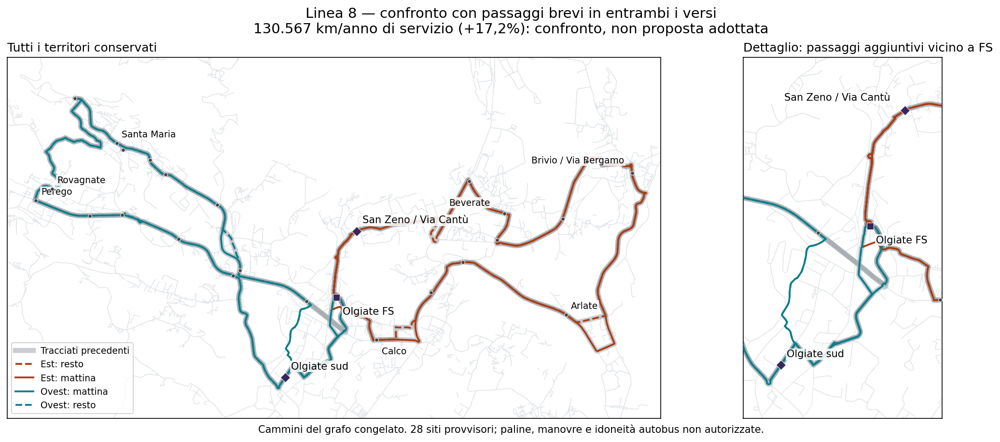

# Linea 8 — quanto costa eliminare i giri lunghi di Olgiate sud e San Zeno?

## Conclusione del confronto

**Sul grafo è possibile dare a entrambi i quartieri viaggi brevi verso e dalla stazione, senza togliere siti agli altri territori. Ma la correzione completa esaminata non è un piccolo sforamento: costa 130.567 km/anno di servizio, +17,19% rispetto a 111.419.** Il precedente confronto era 115.800 km: la modifica aggiunge 14.767 km, non cambia soltanto gli orari.

Il bus incontra il quartiere all'inizio e alla fine della sua ala. Chi arriva dalla stazione scende al primo passaggio; chi va in stazione sale all'ultimo. Sono **occorrenze distinte**, con accessibilità e paline ancora da verificare, non un unico evento magicamente utilizzabile in entrambi i sensi.

Non si adotta questa variante né si alza il budget. Il risultato circoscrive il problema: abbiamo una correzione fisica concreta, il suo prezzo e i suoi effetti sugli altri passeggeri. Non abbiamo dimostrato che ogni diversa rete debba costare altrettanto.

## Confronti principali

Tutti mantengono 36 corse d'ala, 260 giorni ipotetici, le 28 identità/siti di riferimento e le sequenze dei nodi di servizio esistenti. I km non includono deposito o riposizionamenti. I tempi sono a bordo nel caso +10% sulla marcia e 30 secondi per occorrenza, senza attesa né cammino.

| Modifica | Km/anno | Scostamento da 111.419 | Beneficio e rinunce |
|---|---:|---:|---|
| Nessuna, confronto precedente | 115.800 | +3,93% | Quartieri rapidi solo nelle direzioni privilegiate; controflusso 31–32 min |
| Doppio passaggio solo Olgiate sud sulla propria ala | 122.739 | +10,16% | Sud circa 4,1–4,3 min in entrambi i sensi; San Zeno ancora asimmetrico |
| Doppio passaggio solo San Zeno sulla propria ala | 123.629 | +10,96% | San Zeno circa 2,5–2,6 min in entrambi i sensi; sud ancora asimmetrico |
| San Zeno aggiunto anche sull'ala ovest | 120.899 | +8,51% | Collegamento breve per San Zeno tramite ali diverse; non risolve il sud, che peggiora nel controflusso; orario invariato supera H60 in alcuni casi |
| Doppio passaggio per entrambi sulle proprie ali | **130.567** | **+17,19%** | Sud 4,1–4,3 min e San Zeno 2,5–2,6 min in entrambi i sensi; altri viaggi aumentano fino a circa 6 min |
| Entrambi i passaggi aggiunti congiuntamente sull'ala ovest, ordine NS/SN | 129.236 | +15,99% | Fino a circa 9,2 min per i collegamenti locali; altri viaggi aumentano fino a 10,6 min; falliscono H60 e alcuni obiettivi ferroviari con l'orario invariato |

La tabella non è una classifica ponderata. L'artefatto contiene **15 confronti**, compresi l'inserimento incrociato sulle due ali e tutte le quattro combinazioni dei due ordini locali mattina/resto su ciascuna ala. Il minor costo fra i confronti che correggono entrambi i quartieri è 129.236 km, ma non costituisce un orario valido. Non si confonde un minimo geometrico nel dominio con una proposta esercibile.

## Verifica dell'orario per la correzione completa da 130.567 km

Riutilizzando senza modifiche il precedente orario, il controllo H60 ottimistico passa nei 27 scenari, ma manca il margine per alcuni treni mattutini nello stress più gravoso. È conservato anche questo esito negativo.

È poi costruito un confronto separato che anticipa **tutte e cinque le partenze mattutine ovest di un minuto**: 06:33, 07:03, 07:33, 08:03, 08:33. Tutto il resto rimane identico all'[orario ricalibrato precedente](RT031_LINEA8_ORARIO_RICALIBRATO_STESSI_KM_V3.md). Le cinque partenze restano a distanza di 30 minuti; numero di corse e km non cambiano.

In questo confronto:

- Le nuove coincidenze congelate 07:26–09:26 e il controllo H60 aggregato per identità passano nei 27 scenari deterministici. Il margine residuo peggiore dopo tre minuti di trasferimento è soltanto **0,74 minuti**: non è una garanzia osservata di affidabilità.
- Il caso +10% marcia / 30 secondi sosta richiede **4 / 5 / 5 mezzi** con recuperi di 5 / 10 / 15 minuti. Negli stress si arriva a **6 mezzi**. Non si può chiamare correzione a costo operativo invariato.
- Primo treno mattutino 07:26 e fascia delle partenze rimangono quelli del confronto, non un ripristino del servizio dalle 06:00 né della fascia 13–14 ore.
- Cinque corse H30 per gruppo non diventano una certificazione delle due ore comuni H30 per ogni passeggero in ogni direzione. Il cambio di orientamento e le piattaforme richiedono ancora verifica.

## Correzioni soltanto su alcune corse: contabilità, non soluzione pronta

Ripetere una singola correzione su una corsa al giorno per 260 giorni aggiunge circa **373–419 km/anno per Olgiate sud** oppure **422–469 per San Zeno**, secondo l'orientamento. Quattro corse modificate al giorno, una per ciascun orientamento d'ala, porterebbero il solo conto a circa **117.483 km (+5,44%)**.

Questo NON offre collegamenti rapidi tutto il giorno: sono soltanto quattro corse corrette. Mescolare corse con percorsi diversi può inoltre rompere H30 alle fermate anche se le partenze da FS rimangono ogni 30 minuti. Non scegliamo ore o domanda inesistenti, non proponiamo quel conto come compromesso già validato. Occorrerebbe dichiarare quali viaggi devono ricevere la correzione e ricostruire l'orario relativo.

## Dominio, tracciati e riproducibilità

Si minimizza la distanza mantenendo l'ordine dei nodi di servizio originali e aggiungendo uno o due passaggi locali vicino all'estremo della corsa. Lo stato del cammino mantiene l'arco entrante per le restrizioni via-node rappresentate. **Ritorni intermedi a FS sono esclusi**, per non nascondere una sosta, un recupero o un cambio di servizio. Non sono certificate restrizioni dipendenti dall'intera storia, manovre e idoneità autobus.

Le nuove occorrenze vengono enumerate sul cammino stradale; tutte le visite incontrate ai 28 siti sono ipoteticamente servite e conteggiate nelle soste. Il confronto non dimostra fermate autorizzate o continuità passeggeri attraverso eventi non validati. Non vi sono probabilità empiriche, pesi di domanda o un vincitore selezionato.

Gli orari ferroviari restano quelli congelati del **3 settembre 2026**, non un controllo del servizio corrente. La griglia è 0,9/1/1,1 sulla marcia, 0/0,5/1 minuto di sosta, 5/10/15 minuti di recupero. Sono scenari uniformi per viaggio, non ritardi casuali o domanda osservata.

- [Dati, corse, scenari, tempi e costi marginali](../outputs/phase2/rt031_line8_local_shortcuts_v3/local_counterflow.json).
- [Tracciati stradali GeoJSON dei confronti completi](../outputs/phase2/rt031_line8_local_shortcuts_v3/local_counterflow.geojson).
- Generatore: `scripts/phase2_probe_rt031_line8_local_counterflow_v3.py --graph_dir <directory-con-rt017-rt022-successor>`; sorgenti controllate per hash.
- Test: `tests/test_phase2_rt031_line8_counterflow_v3.py`; CI con ricostruzione del grafo e confronto byte per byte.

`network_selected=false`; `primary_selection_authorised=false`; `runner_up_selection_authorised=false`; `decision_budget_km=null`; `uncertainty_band_min=null`.
