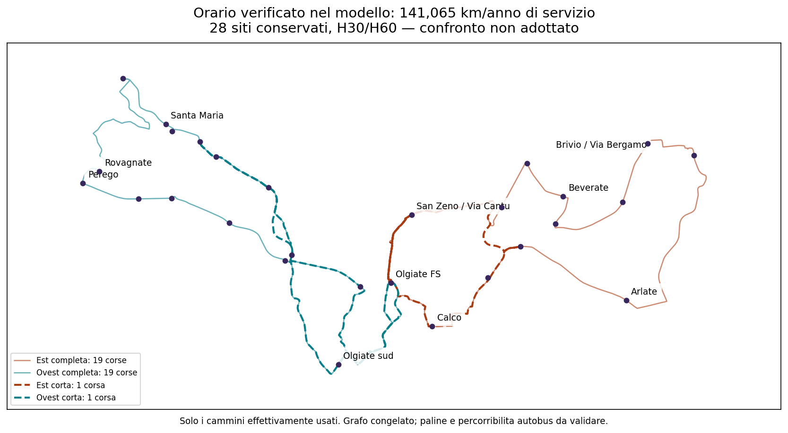
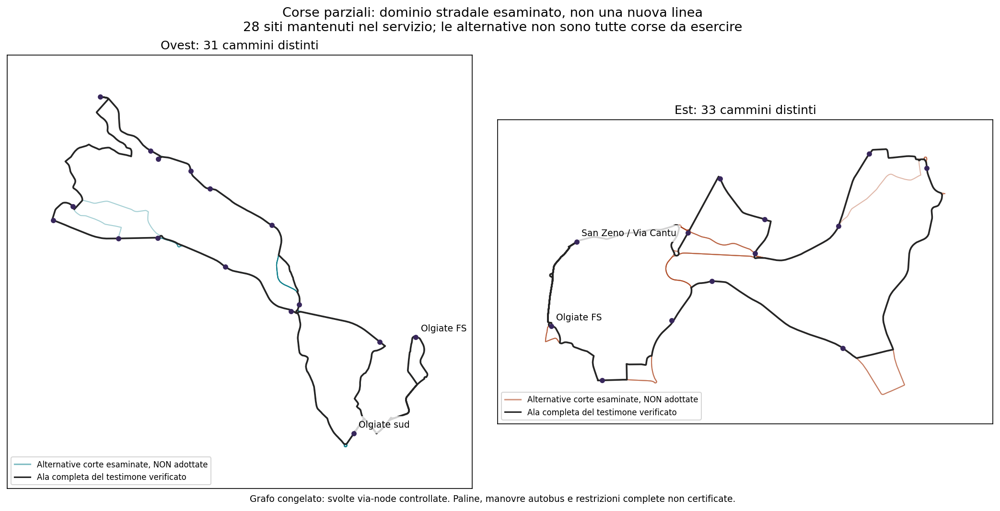

# Linea 8 — corse parziali senza eliminare siti

**Aggiornamento: trovato un orario completo migliore, a 141.064,938 km/anno.** Risparmia **2.864,145 km (circa 1,99%)** rispetto ai 143.929 precedenti, conservando tutti i 28 siti, H30/H60 e gli obiettivi ferroviari del confronto. Non è ancora la proposta entro 111.419: resta **29.645,938 km sopra (+26,61%)**, senza deposito e riposizionamenti.

**La ricerca con fasi libere è ora chiusa:** il minimo è **141.064,938 km** nel dominio dei 64 cammini e delle 49 combinazioni di punta. Il limite inferiore del solver (141.064,938024) coincide con il costo verificato (141.064,938102) alla precisione numerica del confronto. Non è un minimo globale su qualsiasi rete stradale o schema di servizio. Il confronto a punte fissate rimane esatto a 143.929; il nuovo testimone usa fasi differenti. Il [risultato aggiornato](../outputs/phase2/rt031_line8_local_shortcuts_v3/partial_services_phase_closure.json) conserva entrambe le quantità. I risultati iniziali sotto rimangono come storia del confronto, non come miglior orario corrente.

Non sono stati rimossi territori, giorni di servizio o requisiti di frequenza. Non è stata selezionata una rete; nessun risultato intermedio incompleto è presentato come orario utilizzabile.

## Il miglioramento effettivamente verificato

Il giorno-tipo mantiene **40 corse d'ala**: **19 ovest complete + 19 est complete + una corta per ala**. Non è una pura traslazione dell'orario: due corse complete sono sostituite con cammini più brevi, mentre tutte le partenze sono state riottimizzate.

| Corsa parziale del testimone | Partenza FS | Km | Siti/zone del percorso, in sintesi |
|---|---|---:|---|
| Ovest | 16:30 | 9,981 | FS, Olgiate sud, Via della Salute, SP58/Via Cenisio, Giovanni XXIII, Tremonte/Via Trento, ritorno e Olgiate sud |
| Est | 16:35 | 6,682 | FS, San Zeno/Via Cantù, bivio Arlate/Brivio, Calco Via Nazionale e Via Virgilio, San Zeno, FS |

Sono sei identità non-FS distinte nella corsa corta ovest e quattro in quella est, alcune visitate più volte: non equivalgono a nuove paline. La corsa corta est **non serve Arlate–Cantina Pirovano né Brivio centro**; quei siti mantengono i requisiti temporali e ferroviari attraverso le corse complete. Non viene attribuita alla corsa corta una copertura che non ha.

Le punte comuni del testimone finale sono **07:00–09:00 e 16:40–18:40**; H60 nel resto della fascia passeggeri 06:30–19:40. Ultime partenze da FS alle 19:40. Esistono testimoni intermedi a pari costo con altre fasi, non selezionati politicamente. Non è un orario pubblico approvato: le finestre rappresentano attese massime nel modello, non una certificazione di minuti perfettamente cadenzati a tutte le fermate.

Quattro mezzi nominali, fino a sei nella griglia di stress: il miglioramento chilometrico non risolve la disponibilità reale di flotta. Ogni sito mantiene i controlli di frequenza e i collegamenti ferroviari dichiarati in tutti i nove scenari. I viaggi lunghi di alcuni siti sulle corse complete restano; non è una soluzione conforme a tutte le esigenze soltanto perché costa meno.

**Il prezzo organizzativo del risparmio è avere due varianti corte da spiegare ai passeggeri.** Nessun punteggio attribuisce automaticamente al 2% di risparmio più importanza della riconoscibilità della linea. Denominazione pubblica, continuità del servizio passeggeri e paline rimangono da validare. Il confronto mantiene le percentuali pedonali potenziali del registro originario, non dimostra domanda o accessibilità autorizzata.

[Registro corsa per corsa e occorrenze nominali](../outputs/phase2/rt031_line8_local_shortcuts_v3/partial_services_phase_witness.json) · [GeoJSON dei soli cammini usati](../outputs/phase2/rt031_line8_local_shortcuts_v3/partial_services_phase_witness.geojson)

## Che cosa è stato aggiunto

Partendo dalle sequenze originali nelle quattro direzioni, il generatore prova tutti i prefissi e suffissi propri della sequenza delle identità non locali: serve la prima oppure l'ultima parte dell'ala e rientra a FS attraverso un cammino del grafo. Sono **96 richieste**, che con le quattro ali complete producono **64 geometrie distinte**: 31 ovest e 33 est. Le duplicazioni fisiche non diventano candidati diversi.

I percorsi aggiunti vanno da circa 1,719 a 13,990 km. Olgiate sud per l'ovest e San Zeno/Via Cantù per l'est sono mantenuti all'inizio e alla fine della corsa; il circuito soltanto locale ha una sola visita sufficiente ai due versi di viaggio. Le altre occorrenze dei siti originari fisicamente incontrate vengono registrate. Nessuna fermata nuova inventata e nessun ritorno intermedio nascosto a FS.

Ogni cammino è verificato per continuità, distanze, tempi e svolte **via-node rappresentate**. Sono controllate anche tutte le giunzioni fra corse a FS. Questo NON autorizza inversioni sul posto, manovre autobus, paline o restrizioni dipendenti dall'intera storia del percorso: la percorribilità resta condizionale, come per il riferimento.

Il dominio non comprende ogni sottoinsieme, ordine di visita, percorso stradale o schema di servizio possibile. Le corse locali e corte sono alternative da inserire nell'orario, non linee aggiuntive approvate.

## Il controllo che impedisce falsi risparmi

Una corsa che tocca soltanto San Zeno **non soddisfa il collegamento al treno per Brivio, Calco o Arlate**. Il modello ora espone **297 vincoli ferroviari per sito**: 27 siti non-FS × cinque obiettivi AM e sei PM. Ogni collegamento deve esistere su una singola corsa che serve realmente quel sito. Nessuna continuità passeggeri dedotta dal fatto che sia lo stesso veicolo; nessun trasferimento aggiunto implicitamente.

H30 e H60 vengono ricontrollati continuamente per ogni sito e nei due versi da/per FS, attraverso tutti i nove scenari di marcia/sosta. Per i due siti locali, verso FS vale soltanto l'ultima occorrenza, evitando di spacciare il passaggio prima del giro lungo per collegamento breve.

Come prima: 260 giorni identici ipotizzati, disponibilità passeggeri 06:30–19:40, quattro mezzi nominali nel confronto, km di servizio senza deposito/riposizionamenti. Le punte durano due ore ciascuna. Treni congelati al 3 settembre 2026, non orario attuale certificato; il treno delle 20:32 non rientra nella fascia corta. Il tetto di attesa AM rimane quello del riferimento completo.

## Esito iniziale e grado di certezza (prima dell'aggiornamento)

| Confronto | Limite inferiore annuo | Orario completo verificato | Minimo esatto dimostrato? |
|---|---:|---:|---|
| Punte 06:55–08:55 / 16:55–18:55 | 143.929,084 km | 143.929,084 km | Sì, in questo dominio |
| Tutte le 49 combinazioni di fasi ammesse | 131.307,066 km | 143.929,084 km | No |

Le fasi libere iniziano fra 06:30–07:00 e 16:30–17:00, su griglia di cinque minuti. Nessuna è scelta come preferenza normativa.

Il secondo confronto si è fermato al limite di calcolo dichiarato. L'intervallo **131.307–143.929** non è una banda d'incertezza approvata: distingue un limite matematico inferiore dal costo di un testimone fattibile. Non prova che i risparmi siano zero con fasi libere; prova che i 111.419 non sono raggiungibili in quel dominio. I limiti numerici possono diventare più stretti proseguendo il calcolo.

Il primo confronto conservava il testimone precedente: **20 corse ovest B + 20 est A**, nessuna corsa parziale aggiunta. È stato ora migliorato dal testimone descritto all'inizio, senza perdere la riproducibilità di questa evidenza precedente.

## Come è verificata la prova

Per evitare un modello iniziale enorme, si aggiungono vincoli necessari nei punti in cui una soluzione provvisoria lascia un'attesa scoperta. Un risultato provvisorio con lacune non è mai un orario accettato. Con fasi libere, ogni vincolo H30 è condizionato alla propria fase: non si impone per errore contemporaneamente H30 a tutte le fasi.

L'ottimalità viene dichiarata soltanto quando il limite inferiore del problema rilassato raggiunge il costo di un orario già ricontrollato integralmente, oppure quando l'ottimo rilassato supera quel ricontrollo. Il riferimento completo rimane disponibile come testimone anche in caso di timeout. La flotta viene ricontrollata con copertura dei turni-veicolo; non equivale a turni del personale o continuità passeggeri certificati.

Nell'aggiornamento, un controllo su un istante scoperto viene riutilizzato per tutte le fasi che contengono quell'istante. Vincoli identici vengono raggruppati soltanto fra fasi mutuamente esclusive della stessa punta. Nessun cambiamento di requisiti. Il checkpoint salva i testimoni diagnostici e una firma dell'intero dominio: al riavvio i vincoli necessari sono ricostruiti dagli eventi, non accettati come coefficienti opachi; gli orari migliori vengono ripristinati solo dopo verifica completa. I nuovi test coprono equivalenza delle righe raggruppate, separazione AM/PM, deriva del dominio e conservazione del miglior testimone a tempo di calcolo nullo.

## Conseguenza progettuale

Questo ampliamento **non fornisce la proposta finale richiesta**. Esclude un'altra scorciatoia contabile: sostituire alcune corse complete con i ritorni anticipati esaminati, contando come servite fermate saltate.

Non è giustificato continuare a promettere 111.419 su questa famiglia semplicemente modificando i minuti o aggiungendo altre combinazioni delle stesse corse. Un ulteriore miglioramento sostanziale richiede altri ordini/collegamenti fisici oppure una rinuncia esplicita a un requisito; nessuna delle due cose è già dimostrata o adottata qui. Non è una prova globale di impossibilità dell'obiettivo.

[Mappa del percorso completo del testimone rimasto invariato](../outputs/phase2/rt031_line8_local_shortcuts_v3/robustness_cost_diagnostic.png) · [Esito macchina](../outputs/phase2/rt031_line8_local_shortcuts_v3/partial_services_findings.json) · [Tutti i cammini GeoJSON](../outputs/phase2/rt031_line8_local_shortcuts_v3/partial_services_pool.geojson) · [Orario e prova a fasi fissate](../outputs/phase2/rt031_line8_local_shortcuts_v3/partial_services_timetable.json) · [Ricerca con fasi libere](../outputs/phase2/rt031_line8_local_shortcuts_v3/partial_services_flexible_peaks.json)

`network_selected=false`, `primary_selection_authorised=false`, `runner_up_selection_authorised=false`. Budget decisionale, aumento approvato e banda d'incertezza restano non dichiarati; `total_operating_km=null`, `actual_timetable_certified=false`.

Riproduzione: generatore `phase2_probe_rt031_line8_partial_services_v3` con il grafo congelato; solver `phase2_solve_rt031_line8_partial_services_v3`, anche con `--flexible_peaks --strengthen --time_limit 300 --checkpoint <percorso-checkpoint> --output outputs/phase2/rt031_line8_local_shortcuts_v3/partial_services_phase_closure.json`; export aggiornato `phase2_export_rt031_line8_partial_phase_closure_v3`. L'export precedente resta `phase2_export_rt031_line8_partial_services_v3`. I risultati a timeout possono cambiare fra solver/macchine: non si richiede un limite inferiore identico, ma validità e verifica del testimone.
