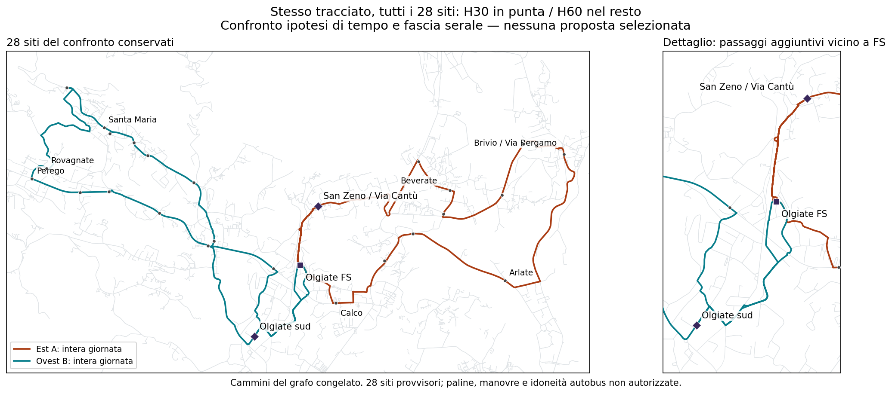

# Linea 8 — quanto incidono stress e calendario

**Il divario dai 111.419 km non è soprattutto un effetto degli stress.** Senza eliminare alcun sito, con collegamenti locali brevi e H30 in punta/H60 nel resto, anche il confronto solo nominale fino alle 19:40 richiede **136.732,629 km/anno di servizio**. La griglia completa arriva a **143.929,084**: la differenza è 7.196,454 km, mentre il nominale è già 25.313,629 km sopra il riferimento.

Questi risultati non selezionano una linea né autorizzano a ridurre l'affidabilità. Chiudono un'altra spiegazione possibile del divario: nelle condizioni dichiarate non basta rimuovere gli stress dal calcolo per rientrare vicino al riferimento.

## Confronto controllato

Gli stessi quattro cammini corretti, **28 siti compresa FS**, nessuna esclusione, due finestre comuni H30 di 120 minuti e H60 nel resto. Quattro mezzi nominali come limite di confronto, 260 giorni identici ipotetici, partenze su griglia di cinque minuti. Fasi e partenze sono riottimizzate; nessuna vecchia corsa è obbligatoria. Le punte possono iniziare 06:30–07:00 e 16:30–17:00, senza selezionare una preferenza normativa.

| Ipotesi vincolanti sui tempi | Ultime partenze FS 19:40 | Ultime partenze FS 20:40 |
|---|---:|---:|
| Solo nominale: marcia ×1,1, sosta 30 secondi | 136.733 km | 143.929 km |
| Marcia ×0,9 / ×1 / ×1,1, sosta sempre 30 secondi | 136.733 km | 143.929 km |
| Griglia completa: tre marce × soste 0 / 30 / 60 secondi | 143.929 km | 151.126 km |

Tutti e sei sono ottimi dimostrati **nei rispettivi domini finiti**, non sulla rete stradale universale. Le due righe complete riutilizzano e ricontrollano gli ottimi precedenti; quattro problemi ridotti sono nuovi. Tutti i testimoni usano ovest B ed est A per l'intera giornata. Le identità restano 28, ma non sono 28 paline autorizzate.

La fascia di disponibilità passeggeri inizia alle 06:30 e termina rispettivamente alle 19:40 o 20:40; non equivale alla prima/ultima salita di ogni sito. La fascia corta rinuncia al treno delle 20:32. Tutti gli altri obiettivi ferroviari restano identici nel confronto della stessa fascia, compreso il limite AM ereditato dalla **griglia completa**, non ricalcolato più favorevolmente per i soli scenari ridotti. Treni congelati al 3 settembre 2026, non orario corrente validato.

## Che cosa significano i 7.196 km

Fino alle 19:40 il nominale usa **19 corse per ala**, la griglia completa **20**. Fino alle 20:40 diventano **20 e 21**. Una coppia di corse complete costa 27,6786699 km/giorno × 260 = **7.196,454 km/anno**. Non sono chilometri creati dallo spostamento di un orario: sono due corse giornaliere in più, documentate nel registro.

Gli orari a griglia ridotta **non superano il contratto completo**: i ricontrolli mostrano violazioni degli obiettivi ferroviari negli scenari con sosta di un minuto; alcuni mostrano anche lacune nella copertura temporale H30. Sono controesempi deterministici, non probabilità di perdere il treno. Il numero di scenari falliti non è una stima del rischio.

La sosta di 30 secondi e la marcia ×1,1 sono ipotesi ingegneristiche, non medie osservate. Il minor costo non autorizza a dichiararle sufficientemente affidabili. Anche gli orari che superano tutta la griglia restano condizionali: fino a sei mezzi negli stress dei testimoni completi, nessuna certificazione di turni, depot o disponibilità reale.

## Perché «tagliamo il weekend» non è un risparmio già disponibile

Il costo annuale corrente è già **costo del giorno-tipo × 260**, non ×365 né ×303. Non esiste ancora un calendario datato che dica quali sabati, domeniche o festivi siano compresi: non è lecito sottrarre altri 104 giorni chiamandoli weekend.

Quanti giorni **identici**, senza cambiare il giorno-tipo, si potrebbero finanziare con 111.419 km?

| Giorno-tipo | Massimo giorni interi | Giorni in meno rispetto a 260 |
|---|---:|---:|
| Nominale fino alle 19:40 | 211 | 49 |
| Griglia completa fino alle 19:40 | 201 | 59 |
| Griglia completa fino alle 20:40 | 191 | 69 |

È un limite aritmetico, **non una proposta di sopprimere quei giorni**. Il costo del deposito e dei riposizionamenti è escluso e potrebbe ridurre ulteriormente il margine. Un calendario con giorni-tipo differenti richiede un calcolo diverso; non è analizzato né approvato qui.

## Indicazione progettuale

Non emerge una proposta che soddisfi contemporaneamente tutte le richieste vicino a 111.419 km. Restano distinte due evidenze:

- Le combinazioni di piccole esclusioni appena chiuse arrivano almeno a 121.341 km nelle condizioni studiate; i quattro testimoni del minimo perdono molto territorio.
- Conservare tutti i siti sulle quattro ali corrette, H30/H60 e servizio fino alle 19:40 richiede 143.929 km nella griglia completa; anche il solo nominale resta a 136.733.

**Non adottare né tagli territoriali pesanti né una riduzione implicita di frequenza o calendario per chiamare “chiusa” la proposta.** Per migliorare ancora il progetto occorre intervenire su un dominio fisico/di servizio diverso da queste quattro corse d'ala complete, oppure concordare esplicitamente una rinuncia o un budget diverso. Non è ancora provato che corse parziali o altri ordini stradali possano soddisfare tutto a minor costo; nessun loro risparmio viene contabilizzato.

Restano anche i viaggi lunghi di alcuni altri siti, la validazione delle paline e dell'intero quartiere sud, la percorribilità autobus e le restrizioni dipendenti dalla storia del percorso. La conservazione delle percentuali pedonali potenziali non risolve questi aspetti e non equivale a domanda servita.

[Sei confronti, corse e controesempi macchina](../outputs/phase2/rt031_line8_local_shortcuts_v3/robustness_cost_diagnostic.json) · [GeoJSON preesistente degli stessi due cammini](../outputs/phase2/rt031_line8_local_shortcuts_v3/joint_evening_witness.geojson)

`network_selected=false`, `primary_selection_authorised=false`, `runner_up_selection_authorised=false`. Nessun `decision_budget_km`, `uncertainty_band_min` o incremento percentuale approvato è stato scelto. `total_operating_km=null`, `actual_timetable_certified=false`.

Riproduzione: `python -m scripts.phase2_audit_rt031_line8_robustness_cost_v3`; test `test_phase2_rt031_line8_robustness_cost_v3.py`. La mappa usa il renderer del grafo congelato; non richiede né introduce nuova geometria.
