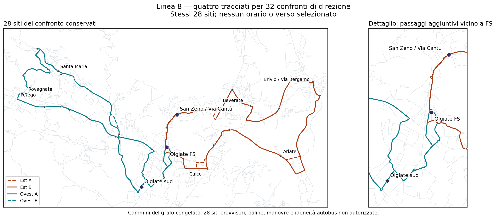

# Linea 8 — cambiare direzione nelle punte: benefici e perdite

**32 confronti completati:** 16 combinazioni mattina/sera × H60 oppure H90 fuori punta. Tutti ottimi nei rispettivi domini finiti. Nessuna direzione è adottata.

## Risultato pratico

Invertire il giro non rende il collegamento veloce per tutti: sposta il viaggio lungo da alcune località ad altre. Ad esempio, con ovest A al mattino Scarpone→FS scende da circa 32,4 a 8,4 minuti, ma Via della Salute→FS sale da 9,7 a 31,0. Con est B, Beverate-Cariplo→FS scende da 30,8 a 8,6, ma Calco-Via Virgilio→FS sale da 7,7 a 32,9.

**Questi cambi di direzione non risolvono il riferimento di 111.419 km.** Il minimo fra i confronti H60 è 143.929 km/anno; quello H90 è 122.340. Sono gli stessi minimi già trovati senza imporre direzioni ai treni: aggiungere un vincolo non può migliorare quel minimo. Non è una nuova ricerca di scorciatoie stradali, né una prova di impossibilità su altre reti.

## Tutti i confronti, senza scegliere un vincitore

Ogni coppia indica **ovest, est**: `AB` = ovest A + est B. La prima coppia riguarda le corse legate ai cinque treni AM; la seconda quelle legate ai sei arrivi PM, compreso 19:32. Le altre corse possono usare entrambi i versi per chiudere le frequenze. Non è quindi necessariamente un cambio di senso unico a una certa ora.

| Direzioni AM → PM | Km/anno H60 nel resto | Km/anno H90 nel resto, non approvato |
|---|---:|---:|
| AA → AA | 144.308 | 122.662 |
| AA → AB | 145.619 | 127.487 |
| AA → BA | 144.043 | 126.136 |
| AA → BB | 145.354 | 130.961 |
| AB → AA | 145.432 | 127.300 |
| AB → AB | 148.054 | 125.846 |
| AB → BA | 145.166 | 130.774 |
| AB → BB | 147.788 | 129.319 |
| BA → AA | 144.062 | 126.155 |
| BA → AB | 145.373 | 130.980 |
| BA → BA | 143.929 | 122.340 |
| BA → BB | 145.240 | 127.165 |
| BB → AA | 145.185 | 130.792 |
| BB → AB | 147.807 | 129.338 |
| BB → BA | 145.053 | 126.977 |
| BB → BB | 147.674 | 125.523 |

Il confronto intuitivo **AB → BA** (versi invertiti al mattino, B/A nel resto ferroviario) richiede 145.166 km con H60 oppure 130.774 con H90: non è una modifica gratuita delle ore di partenza. Cambiano percorsi e corse necessarie per mantenere le finestre comuni e le coincidenze.

Tutti i testimoni usano quattro mezzi nominali e arrivano a sei nella griglia di stress. Questo **non dimostra che sei siano necessari**: il precedente testimone BA→BA/H90, agli stessi km, è stato riverificato sotto i nuovi vincoli e resta a cinque nello stress. Il risolutore minimizza km, non sceglie fra orari a pari km in base alla riserva.

## Tempi per tutti i siti, entrambi i versi stradali

Minuti nominali sul bus, senza cammino, attesa o cambio treno. Per ogni ala A e B sono **due cammini stradali del grafo**, non un’inversione geometrica presunta. Verso FS è la dimensione mostrata per la punta AM; da FS per la PM. La stessa direzione deve valere per tutti i siti sulla corsa: non si possono combinare i minimi di righe diverse.

| Ala / sito | Verso FS con A | Verso FS con B | Da FS con A | Da FS con B |
|---|---:|---:|---:|---:|
| Ovest / Olgiate Molgora - Scarpone | 8.4 | 32.4 | 32.4 | 8.4 |
| Ovest / Olgiate Molgora - Via Della Salute | 31.0 | 9.7 | 9.8 | 31.2 |
| Ovest / Olgiate Molgora - Via Statale | 32.9 | 7.7 | 7.8 | 33.2 |
| Ovest / Perego - Statale / Via S. Caterina | 14.4 | 26.4 | 26.4 | 14.5 |
| Ovest / Santa Maria Hoè - Alduno | 10.2 | 30.6 | 30.6 | 10.3 |
| Ovest / Rovagnate - Statale / Via Lombardia | 12.9 | 27.9 | 27.9 | 13.0 |
| Ovest / Rovagnate - Statale / AGIP | 11.8 | 29.0 | 29.0 | 11.9 |
| Ovest / Santa Maria Hoè - Via Como / Alpino | 24.3 | 16.5 | 16.5 | 24.4 |
| Ovest / Santa Maria Hoè - Via Giovanni XXIII / Tremonte-Via Leopardi | 26.7 | 14.2 | 14.1 | 26.7 |
| Ovest / S. Maria Hoè - S.P. 58 ang. Via Cenisio | 28.6 | 12.3 | 12.2 | 28.6 |
| Ovest / S.Maria Hoe' | 23.5 | 17.3 | 17.3 | 23.6 |
| Ovest / Santa Maria Hoè - Tremonte / Via Trento | 25.6 | 15.2 | 15.1 | 25.6 |
| Ovest / Hoe' | 21.4 | 19.4 | 19.4 | 21.5 |
| Ovest / Rovagnate - vinicola ghezzi | 15.5 | 25.2 | 25.2 | 15.6 |
| Ovest / Olgiate sud | 4.1 | 4.1 | 4.3 | 4.3 |
| Est / Arlate - B.vio Brivio - Madonnina | 12.1 | 28.6 | 27.0 | 12.3 |
| Est / Arlate - Cantina Pirovano | 16.0 | 24.8 | 23.2 | 16.2 |
| Est / Brivio - Via Como (pizzeria / Bar Cristallo) | 23.3 | 16.0 | 15.9 | 25.0 |
| Est / Calco - Via Virgilio | 7.7 | 32.9 | 31.5 | 8.1 |
| Est / Brivio - Vaccarezza | 25.4 | 13.9 | 13.8 | 27.1 |
| Est / Brivio - Via Bergamo (Scuola Materna) | 21.1 | 18.2 | 18.0 | 22.8 |
| Est / Brivio - beverate (cariplo) | 30.8 | 8.6 | 8.4 | 32.4 |
| Est / Brivio - beverate (paese) | 28.8 | 10.5 | 10.4 | 30.4 |
| Est / Brivio - beverate (quattro strade) | 27.3 | 12.0 | 11.8 | 29.0 |
| Est / Calco - via Nazionale | 10.4 | 30.4 | 28.8 | 10.6 |
| Est / Calco - via nazionale (peugeot) | 32.2 | 6.2 | 7.0 | 33.8 |
| Est / San Zeno/Via Cantu | 2.6 | 2.6 | 2.5 | 2.5 |

Olgiate sud e San Zeno mantengono i passaggi brevi distinti per scendere da FS e salire verso FS. I siti sono sempre 28 compresa FS; non equivalgono a 28 paline autorizzate. Nessuna continuità passeggeri viene inferita dal riuso dello stesso mezzo.

## Assunzioni e limiti mantenuti visibili

- Finestre comuni H30: **06:50–08:50 e 16:35–18:35**, fissate solo per confrontare le direzioni a parità di servizio; non approvate.
- Disponibilità passeggeri confrontata: **06:30–19:40**. Il treno 20:32 del riferimento più lungo non è servito; primo treno AM vincolato 07:26, non 06:56.
- Treni congelati al **3 settembre 2026**, non orario corrente. Cinque obiettivi AM e sei PM, stessi margini del confronto precedente.
- Nove scenari marcia/sosta per frequenze e coincidenze; 27 includendo recuperi per i mezzi. Non probabilità di affidabilità.
- **260 giorni ipotizzati**; km di servizio soltanto, senza deposito e riposizionamenti. H60 resta la richiesta, H90 è un rilassamento non adottato.
- Tempi, percorribilità autobus, restrizioni dipendenti dalla storia del percorso, paline, turni e budget totale restano da validare. Nessuna soglia normativa sui tempi di viaggio.

## Tracciati e dati riproducibili



[GeoJSON dei quattro cammini effettivamente usati nei testimoni](../outputs/phase2/rt031_line8_local_shortcuts_v3/peak_direction_comparison.geojson) · [32 orari, vincoli ferroviari e profili di viaggio macchina](../outputs/phase2/rt031_line8_local_shortcuts_v3/peak_direction_comparison.json)

```powershell
$env:PYTHONPATH='.;src'
python -m scripts.phase2_compare_rt031_line8_peak_directions_v3 --time_limit 15
python -m scripts.phase2_export_rt031_line8_peak_directions_v3
python -m unittest discover -s tests -p test_phase2_rt031_line8_peak_directions_v3.py
```

**Conclusione:** nessuna delle combinazioni può essere presentata come soluzione che migliora tutti i collegamenti senza rinunce. La frequenza e il budget non sono gli unici nodi rimasti: occorre anche rendere espliciti i tempi accettabili per località. Non viene scelto un vincitore tramite somme, pesi o conteggi dei siti favoriti.
