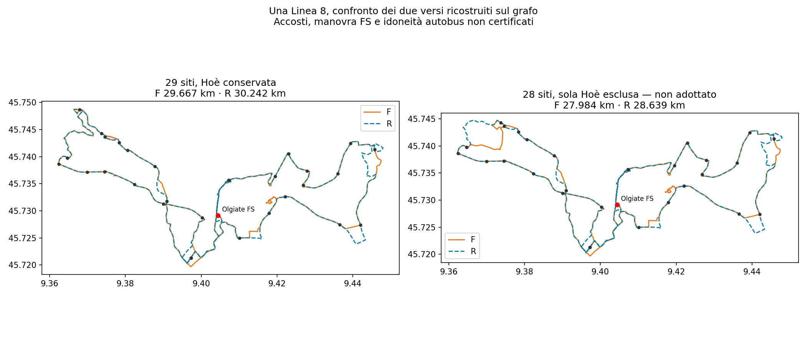

# Linea 8 — esito del confronto conclusivo circoscritto

## Conclusione verificabile, senza una falsa selezione finale

**Non è stata trovata una proposta che soddisfi contemporaneamente tutti gli obiettivi nel dominio qui verificato.** Il confronto dei due versi richiesto è stato eseguito, non rinviato. Non autorizza a dichiarare impossibile ogni Linea 8, a scegliere H70, a togliere Hoè o a scegliere PRIMARY. La proposta pubblica non è ancora pronta: chiamarla finale nasconderebbe conflitti sostanziali.

## Cosa cambia davvero invertendo il verso

La ricostruzione visita gli eventi di servizio in ordine inverso sul grafo diretto, mantenendo FS e le due occorrenze locali. Non è una polilinea invertita e non certifica il lato opposto della palina.

| Configurazione | Verso F: ovest poi est | Verso R: est inverso poi ovest inverso |
|---|---:|---:|
| Tutti i 29 siti | 29,667 km | 30,242 km |
| Sola Hoè esclusa, non adottato | 27,984 km | 28,639 km |

Nel caso da28 siti, Beverate Cariplo→FS cambia da34,47 a8,45 minuti e Scarpone→FS da30,24 a8,35. Nell'altro verso cambiano invece FS→Beverate da8,41 a36,97 minuti e FS→Scarpone da8,44 a29,70. Non è dominanza: mantenere un evento in ciascun verso e avere entrambi i versi realmente disponibili quando servono sono condizioni diverse. Le due occorrenze di Olgiate sud e San Zeno rimangono distinte. La copertura potenziale ai punti invariati non è una garanzia di accosto/sicurezza del verso opposto.

**Anche prima di fare l'orario**, 16 giri scelti da questo pool producono almeno123.413 km con tutti i29 siti e almeno116.412 km senza Hoè su260 giorni ipotizzati. Sono limiti inferiori di questo pool, non del grafo o di tutte le possibili linee. Il verso inverso non recupera il budget da solo.

## L'orario è stato verificato, non dedotto dai tempi migliori

Sono stati eseguiti **16 confronti** a16 giri completi totali, non16 per verso:

- due insiemi di siti:29 conservati oppure28 senza Hoè;
- soste intermedie con offset massimo55 oppure85 minuti dalla partenza iniziale;
- H60 readiness nelle spalle e H12010–16;
- gruppi H30 di cinque treni consecutivi reali archiviati per ciascuna ala/punta;
- gruppi direzionalmente coerenti (R mattino, F sera), oppure combinazione libera dei due versi;
- confronti aggiuntivi solo nominali, sia F soltanto sia F/R combinati, con stress riportabile separatamente.

**11 confronti hanno prova di infeasibilità; cinque sono irrisolti senza testimone positivo.** Il caso a28 siti, combinazione libera, offset massimo85, nove scenari comuni è stato rieseguito con300 secondi e rimane irrisolto senza testimone. Un timeout non è prova di infeasibilità. I casi con max55 e nove scenari hanno esito negativo; non viene trasformato questo risultato in impossibilità globale.

Il nominale non viene spacciato per affidabilità: uno scenario nominale positivo, se trovato, dovrebbe comunque riportare le violazioni dei nove stress, le soste FS, i27 fabbisogni di flotta e gli eventi passeggeri. Nessuna probabilità empirica è derivata dal numero di stress falliti. Il minimo in km, se dimostrato, sarebbe soltanto nel dominio del caso, non un optimum di utilità passeggeri o una scelta Pareto globale.

## Quale conclusione progettuale portare alla scelta

La direzione raccomandata per chiudere il progetto è **proteggere H30 ferroviario e un orario leggibile, non adottare H70 per fare tornare il modello**. Questa è una raccomandazione di priorità, non l'autorizzazione ad abbandonare territori o a cambiare silenziosamente i16 giri. Con le attuali evidenze non è possibile presentare una rete finale conforme senza un ulteriore cambio dichiarato e verificato.

Restano tre leve, nessuna già approvata:

1. Modificare più profondamente il tracciato/insieme delle fermate, con nuove shape e perdite territoriali esplicite: la sola inversione non basta.
2. Aumentare produzione/corse: il testimone monodirezionale da18 giri H60 è a130.963 km, +17,54%, e non è raccomandato automaticamente come piccolo sforamento.
3. Cambiare i periodi o la regola di servizio: ogni lacuna deve comparire nell'orario reale, senza etichettare H60 un servizio H70. Le finestre readiness comuni, i margini e la griglia sono anche assunzioni ingegneristiche da distinguere dall'intento del chiamante, ma non vengono eliminati tacitamente per ottenere un testimone.

**Nessuna delle tre leve è una conclusione finanziata o selezionata.** La famiglia appena confrontata può essere chiusa come non pronta; il progetto intero non può essere dichiarato concluso con una proposta che oggi non esiste. Questa distinzione evita di ripresentare ogni volta il candidato diagnostico come soluzione finale.

I dettagli di tutti i28 punti e i13 requisiti rimangono nel [dossier unico](RT031_LINEA8_DOSSIER_UNICO_ISTRUTTORIO_V3.md). Calendarizzazione reale, km non commerciali, disponibilità mezzi e verifiche fisiche restano non certificati. Gli obiettivi ferroviari usano un dataset congelato, non una verifica degli orari ferroviari odierni.

`network_selected=false`, `primary_selection_authorised=false`, `runner_up_selection_authorised=false`, `decision_budget_km=null`, `uncertainty_band_min=null`.

[Strade e metriche dei due versi](../outputs/phase2/rt031_line8_local_shortcuts_v3/bidirectional_closure.json.gz) · [Tutti i16 esiti d'orario](../outputs/phase2/rt031_line8_local_shortcuts_v3/two_direction_timetable.json.gz) · [GeoJSON](../outputs/phase2/rt031_line8_local_shortcuts_v3/bidirectional_closure.geojson).
