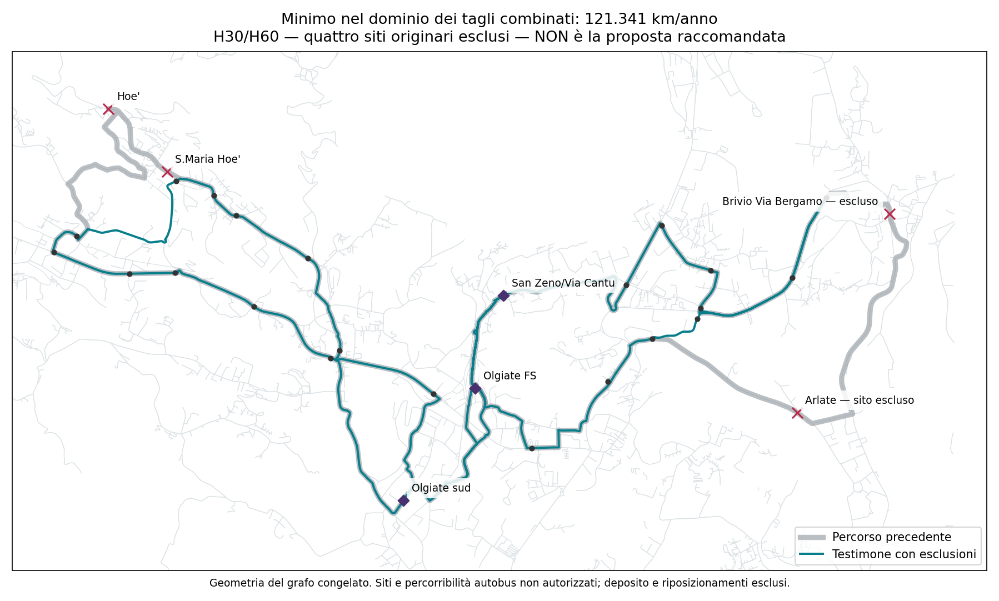

# Linea 8 — esito delle modifiche combinate

**Questa famiglia di tentativi è chiusa rispetto ai 111.419 km:** combinando le modifiche esaminate, il minimo del dominio dichiarato è **121.340,751 km/anno di servizio**, con H30 in punta/H60 nel resto. È **+9.921,751 km (+8,90%)**, prima di deposito e riposizionamenti.

Non è la proposta finale: i quattro testimoni completi che raggiungono il minimo presentano perdite territoriali importanti. Nessuna delle quattro combinazioni viene adottata o raccomandata.

## Che cosa è stato dimostrato

- **285 scelte ovest × 426 est = 121.410 combinazioni**, comprese le ali senza modifiche. Sono tutte le combinazioni del precedente schermo di spostamento fermate, non tutte le reti possibili.
- Primo controllo: 50 problemi molto ottimistici, con marcia al 90% e soste nulle, danno già un limite inferiore di 111.852,616 km per l’intera famiglia. Non era ancora un orario.
- Secondo controllo: **41 gruppi equivalenti solo per tempi locali, treni e costo**, con tutti i nove scenari marcia/sosta. Il limite inferiore sale a 121.340,751 km. Nessuna equivalenza di copertura viene dedotta dal raggruppamento.
- Quattro orari completi, verificati per **tutti i siti dichiarati**, raggiungono quel limite con quattro mezzi nominali. Limite inferiore e testimone fattibile coincidono: il minimo è provato nel dominio.
- Le 121.410 combinazioni non sono state tutte risolte come orari completi: sono coperte dal limite inferiore. La copertura pedonale congiunta è stata ricalcolata per quattro testimoni, senza sommare le perdite delle singole ali.

## Il prezzo territoriale dei quattro testimoni economici

Tutti e quattro rinunciano ai siti originari **Arlate–Cantina Pirovano, Brivio–Via Bergamo (Scuola Materna), S. Maria Hoè e Hoè**. Il caso senza nuove fermate contiene 25 siti: 24 dei 28 originari e un altro sito d’inventario incontrato sul nuovo percorso. Gli altri tre aggiungono uno o due punti ipotetici sulle scorciatoie, arrivando a 26 o 27 siti; non ripristinano le identità eliminate.

Copertura pedonale potenziale entro **10 minuti**, caso senza nuovi punti:

| Comune | Prima | Dopo | Differenza in punti percentuali |
|---|---:|---:|---:|
| Brivio | 89.09% | 69.40% | -19.69 pp |
| Calco | 68.21% | 56.13% | -12.08 pp |
| Olgiate Molgora | 84.56% | 84.56% | +0.00 pp |
| Santa Maria Hoe | 95.75% | 91.89% | -3.86 pp |
| La Valletta Brianza | 67.85% | 67.84% | -0.00 pp |

Nei due casi con punto aggiuntivo ovest, La Valletta Brianza recupera quasi tutta la piccola perdita. Le perdite maggiori restano pressoché identiche nei quattro testimoni: circa **−19,7 pp Brivio, −12,1 pp Calco, −3,9 pp Santa Maria Hoè**. Le percentuali non sono passeggeri o domanda: includono le ipotesi sulle fermate non autorizzate e sui connettori pedonali. I JSON espongono anche soglie 5/8 minuti e perdita lorda dei nuclei precedentemente coperti, non soltanto il saldo.

## Orario e risorse del testimone illustrato

39 corse d’ala al giorno: **20 ovest B + 19 est A**. Prima partenza FS 06:35 ovest / 06:40 est, ultime partenze 19:40. La fascia di disponibilità passeggeri 06:30–19:40 non è una promessa di prima/ultima salita identica in ogni sito.

Punte comuni confrontate: **06:50–08:50 e 16:35–18:35**; H60 nel resto. Sono vincoli di attesa massima modellata, non ancora un orario pubblico perfettamente cadenzato. Nessuna H90/H120 introdotta.

Tutti e quattro i testimoni: **quattro mezzi nominali**, fino a **cinque** nella griglia di stress. Disponibilità mezzi, turni, deposito e affidabilità osservata non sono certificati. I treni restano quelli congelati del 3 settembre 2026, con primo obiettivo AM 07:26 e ultimo arrivo PM 19:32; l’obiettivo 20:32 del confronto più lungo non è incluso.

## Tracciato reale del confronto, non una proposta scelta

La mappa mostra il caso senza nuovi punti, scelto solo per illustrare le esclusioni senza sovrapporre alternative di fermata. Grigio: percorso precedente; verde: ovest B/est A effettivamente usati; croci rosse: quattro siti originari non serviti. Olgiate sud e San Zeno rimangono distinti e presenti, con collegamenti locali brevi nei due versi.

## Come usare questo risultato

**Non proseguire a combinare queste stesse scorciatoie sperando di trovare 111.419 km:** nelle condizioni dichiarate il limite è dimostrato. Questo non prova l’impossibilità su altre geometrie, ordini di fermate, finestre di punta, calendari o fasce. Il risultato non autorizza un aumento del budget, né una perdita territoriale. Non esiste qui un vincitore da inviare come proposta finale.

[Chiusura macchina del dominio](../outputs/phase2/rt031_line8_local_shortcuts_v3/combined_edits_closure.json) · [Limiti sui 41 gruppi](../outputs/phase2/rt031_line8_local_shortcuts_v3/combined_edits_timing_bounds.json) · [Quattro orari e copertura ricalcolata](../outputs/phase2/rt031_line8_local_shortcuts_v3/combined_edits_joint_diagnostics.json) · [GeoJSON del testimone illustrato](../outputs/phase2/rt031_line8_local_shortcuts_v3/combined_edits_diagnostic.geojson)

Percorribilità autobus, restrizioni dipendenti dall’intera storia del percorso, paline e continuità passeggeri restano condizionali. `network_selected`, `primary_selection_authorised`, `runner_up_selection_authorised` restano `false`; budget decisionale, banda d’incertezza, aumento approvato e km operativi totali non sono scelti o noti.
