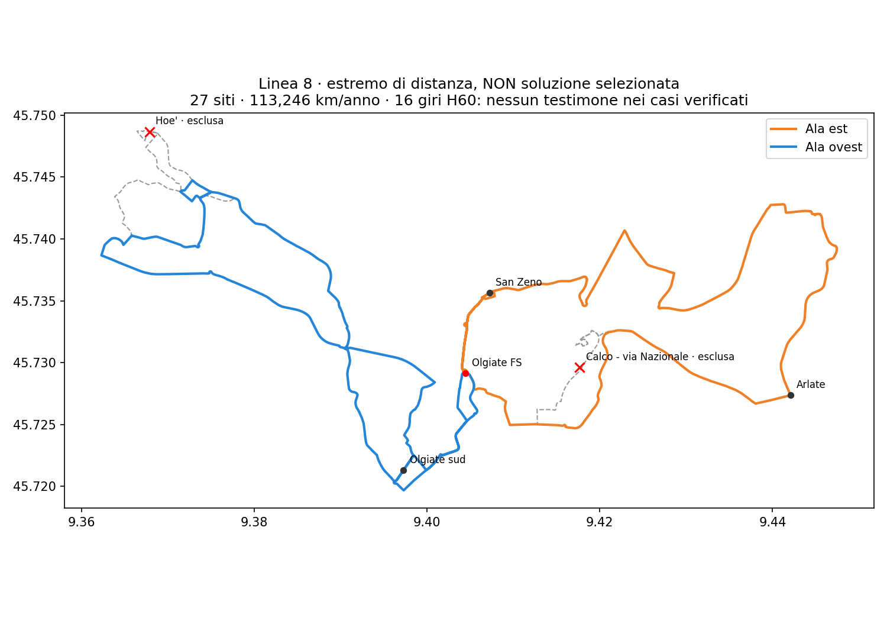

# Linea 8 — chiusura del confronto sui piccoli tagli

## Risultato, non selezione

Il confronto è stato completato: **326 configurazioni**, tutte le omissioni di zero, una o due delle 25 identità di inventario ammesse al test. Restano protetti FS, le due occorrenze di Olgiate sud, le due di San Zeno/Via Cantù e l'aggiunta Arlate N1212. Ogni corsa mantiene entrambe le ali e lo stesso ordine delle fermate rimaste. Non vengono inventati vincoli territoriali, soglie accettabili di perdita o pesi di utilità.

Nessuna configurazione raggiunge 111.419 km con 16 giri e 260 giorni ipotizzati. Quattro stanno sotto il confronto specifico da 115.143,267 km già discusso; **tutti gli otto test H60 a 16 giri**, nelle due sequenze delle ali, sono infeasibili nel dominio dichiarato. Questo chiude il test sui relativi percorsi distanza-minima: non è una prova di impossibilità di altri percorsi, anche a ordine conservato, né di ogni calendario o ogni Linea 8.

**Un giro aggiuntivo cambia il risultato:** tutte e quattro le geometrie hanno almeno un testimone a 17 giri con H30 ferroviario, cap H60 nelle spalle e H120 solo 10–16. Il più economico di questi quattro confronti produce **120.323,896 km/anno**, +8.0% rispetto a 111.419, togliendo Hoè (`FROZEN::300873`) e Calco–via Nazionale (`FROZEN::300634`). Non è il candidato selezionato, né il minimo globale fra tutte le reti.

## I quattro confronti economici, tutti riportati

| Fermate escluse, non adottato | Km a 16 giri | Test H60 a 16 giri | Km a 17 giri | Sequenza con testimone a 17 |
|---|---:|---|---:|---|
| Hoè + Calco–via Nazionale | 113.246 | negativo in entrambe | 120.324 | ovest→est ed est→ovest |
| Hoè + S. Maria Hoè | 113.459 | negativo in entrambe | 120.550 | est→ovest |
| Hoè + Via Como/Alpino | 114.443 | negativo in entrambe | 121.596 | est→ovest |
| Hoè + Calco–Via Virgilio | 115.117 | negativo in entrambe | 122.311 | est→ovest |

Le perdite territoriali non sono equivalenti. Escludere anche S. Maria Hoè porta la perdita locale a 16,25 punti a 5 minuti; escludere Via Virgilio costa a Calco 19,47 punti a 8 minuti. Il costo minore non sostituisce la valutazione di queste conseguenze. La frontiera km/copertura comunale comprende 27 casi, è senza pesi, **non** è una frontiera completa di qualità passeggeri o esercizio. Non è stata utilizzata per potare i test d'orario dei quattro casi.

## Tracciato del solo estremo di distanza

Linea colorata: due tagli. Tratteggio: riferimento con tutti i 29 siti. Sono **27 siti di progetto inclusa FS**, non 27 paline autorizzate. Le strade sono ricostruite sul grafo diretto con regole via-node rappresentate e senza inversioni immediate dentro le ali. Il taglio Calco elimina la necessità dell'ipotesi di accosto spostato di 19 m per quel sito. Restano non certificati idoneità autobus, piattaforme, manovra/continuità a FS e restrizioni complete dipendenti dalla storia del percorso.

### Fermate del confronto da 27 siti

FS è l'unico nodo comune. Entrambi i richiami locali sono eventi distinti, non garanzie ricavate dalla sola identità.

| Ala ovest, ordine conservato | Ala est, ordine conservato |
|---|---|
| Olgiate sud, uscita | San Zeno/Via Cantù, uscita |
| Olgiate–Scarpone | Via Nazionale/Peugeot, identità conservata distinta dalla fermata esclusa |
| Alduno | Beverate/Cariplo |
| Rovagnate–Statale/AGIP | Beverate/paese |
| Rovagnate–Statale/Via Lombardia | Beverate/quattro strade |
| Perego–Statale/Via S. Caterina | Vaccarezza |
| Rovagnate–Vinicola Ghezzi | Brivio–Via Como/Bar Cristallo |
| S. Maria Hoè | Brivio–Via Bergamo/Scuola Materna |
| S. Maria Hoè–Via Como/Alpino | Arlate N1212, nuova ipotesi di fermata |
| Tremonte/Via Trento | Arlate–Cantina Pirovano |
| Via Giovanni XXIII/Tremonte–Via Leopardi | Arlate–Bivio Brivio/Madonnina |
| S.P.58/Via Cenisio | Calco–Via Virgilio |
| Olgiate–Via della Salute | San Zeno/Via Cantù, rientro |
| Olgiate–Via Statale | |
| Olgiate sud, rientro | |

Sono nomi dell'inventario, non certificazioni che tutte le località desiderate siano servite adeguatamente. Monticello/Mondonico, Calco alta/Cornello, Cassina, Crescenzaga, oratorio e Casa di Comunità mantengono le lacune di associazione del dossier. Il punto Olgiate sud non dimostra la copertura integrale del perimetro residenziale provvisorio.

### Copertura potenziale pedonale dei 27 punti

| Comune | Entro 5 min | Entro 8 min | Entro 10 min |
|---|---:|---:|---:|
| Olgiate Molgora | 40,41% | 73,18% | 84,56% |
| Calco | 26,95% | 54,48% | 70,35% |
| Brivio | 53,59% | 83,31% | 90,18% |
| La Valletta Brianza | 45,78% | 60,36% | 67,85% |
| Santa Maria Hoè | 64,21% | 88,60% | 93,43% |
| Totale | 42,99% | 69,46% | 79,66% |

Rispetto ai 29 punti: Santa Maria Hoè perde 8,67/6,22/2,32 **punti percentuali**; Calco perde 4,39/4,12/5,40 punti; gli altri tre comuni non perdono copertura in questo modello. Il dato congiunto è ricalcolato sulla matrice pedonale congelata, dopo aver riprodotto la baseline storica a 28 siti. Non è domanda OD, quota di passeggeri, accessibilità fisica certificata o copertura di un servizio già operante.

## Orario positivo a 17 giri: i termini esatti

Si conservano griglia di 5 minuti, nove scenari runtime/dwell, margine minimo treno di 3 minuti al mattino, partenze bus 3–8 minuti dopo il treno alla sera, tetto di attesa ferroviaria ereditato e quattro gruppi di cinque treni consecutivi. I treni provengono dal dataset congelato: non sono verificati come orario ferroviario odierno. Il cap H60 è una verifica di readiness nei periodi del modello, non una promessa che ogni intervallo dell'intera giornata sia esattamente 60 minuti.

Il caso est→ovest dell'estremo di distanza ha queste partenze. **Ogni riga è una sola corsa completa**, con permanenza a bordo a FS progettata, non due linee o due corse vendute come una:

| FS iniziale verso est | FS intermedia verso ovest |
|---|---|
| 06:05 | 07:00 |
| 06:35 | 07:30 |
| 07:05 | 08:00 |
| 07:35 | 08:30 |
| 08:05 | 09:00 |
| 09:00 | 09:50 |
| 10:00 | 10:50 |
| 11:55 | 12:45 |
| 13:40 | 14:30 |
| 15:10 | 16:00 |
| 16:10 | 17:00 |
| 16:40 | 17:35 |
| 17:10 | 18:05 |
| 17:40 | 18:35 |
| 18:10 | 19:05 |
| 18:45 | 19:35 |
| 19:40 | 20:30 |

Fine dell'ultima corsa circa **21:09**, nel nominale ereditato. Gruppi ferroviari: est mattina 06:56–08:56, ovest mattina 07:56–09:56; est rientro da Milano 16:02–18:02, ovest 17:32–19:32. Le finestre sono sfalsate: non vengono dichiarate identiche per tutte le frazioni. Sono compatibili 17 dei 22 obiettivi ferroviari originari; la variante ovest→est ne conserva 18. Quattro gruppi H30 non significano tutti i 22 target originari garantiti.

Il minimo della **somma** delle soste intermedie è provato nel dominio del caso; non è il minimo della massima sosta né un optimum di utilità. La sosta massima nominale è 14,99 minuti est→ovest, 15,81 ovest→est. **Nei nove scenari arriva rispettivamente a 27,58 e 29,07 minuti**: il nominale non è una garanzia di attesa reale e una corsa più rapida sulle strade può significare più attesa a FS prima della prosecuzione. Tutti gli scenari sono riportati nell'artefatto. Il fabbisogno è al massimo quattro mezzi nei 27 scenari di questi due testimoni; disponibilità, turni, deadhead e finanziamento non sono approvati.

## Cosa non è ancora risolto e quale scelta serve

Questo risultato **non soddisfa tutto**: cambia i 16 giri adottati, elimina due fermate, supera il confronto economico specifico approvato, sfalsa le punte fra le ali e conserva viaggi lunghi. Ad esempio Scarpone→FS resta circa 30,24 minuti, Beverate/Cariplo→FS circa 31,10 e Peugeot→FS circa 32,56 nel nominale. Nessuna soglia di viaggio accettabile è inventata per dichiararli buoni. Conservare l'ordine migliora o non peggiora i tempi dei punti rimasti rispetto al riferimento, ma non trasforma un viaggio lungo in uno breve.

La decisione successiva non è un altro “avanti” indistinto: **accettare o rifiutare il confronto da 17 giri, circa 120.324 km, con queste due esclusioni e le perdite esplicite**. Se accettato come base di sviluppo, non autorizza comunque selezione PRIMARY/RUNNER-UP, finanziamento o idoneità fisica; le questioni dei tempi lunghi e delle località non associate rimangono nel dossier. Se rifiutato, i testimoni verificati di questa famiglia non possono essere ripresentati come soluzione conforme ai 16 giri.

260 giorni è ancora un'ipotesi di confronto. Km non commerciali esclusi. Nessuna selezione automatica di `decision_budget_km` o `uncertainty_band_min`; nessun GJT pesato sulla domanda o probabilità empirica di mancata coincidenza inventata. Non si esegue un finalizer legacy incompatibile.

`network_selected=false`, `primary_selection_authorised=false`, `runner_up_selection_authorised=false`, `decision_budget_km=null`, `uncertainty_band_min=null`.

[Tutti i 326 casi e gli orari verificati](../outputs/phase2/rt031_line8_local_shortcuts_v3/paired_cuts_fixed_order.json.gz) · [Tutte le shape stradali](../outputs/phase2/rt031_line8_local_shortcuts_v3/paired_cuts_fixed_order.geojson) · [Dossier e limiti pregressi](RT031_LINEA8_DOSSIER_UNICO_ISTRUTTORIO_V3.md).
