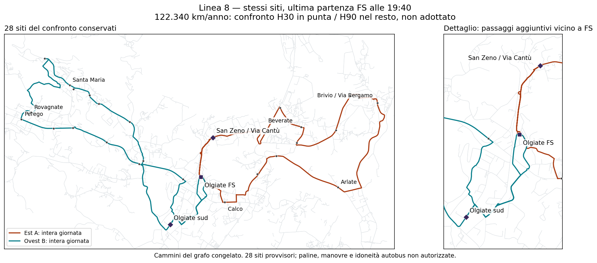

# Linea 8 — fascia più corta e distanza dal budget

## Esito

**Con gli stessi 28 siti e i collegamenti locali brevi, arriviamo a 122.340 km/anno con ultima partenza FS alle 19:40 e H90 fuori punta.** Il caso serale fino alle 20:40 costava 129.536: il risparmio è di **7.196 km/anno**, una coppia di corse d'ala al giorno.

Un confronto ulteriore, **non adottato**, mantiene le stesse due ore di punta ma consente H120 nel resto: **115.143 km/anno, +3,34%** sul riferimento. La rinuncia è una possibile attesa di due ore fra le punte. Non è equivalente al servizio H60 richiesto inizialmente o al confronto H90.

Nessun caso soddisfa ancora contemporaneamente tutti i requisiti e il riferimento 111.419. Gli importi sono km di servizio su **260 giorni assunti**, prima di deposito/riposizionamenti e costi dei turni.

## Tre compromessi leggibili

| Confronto | Ultima partenza FS | Fuori punta | Corse/giorno | Km/anno | Eccedenza sul riferimento | Mezzi nominali / massimo stress |
|---|---|---|---:|---:|---:|---:|
| Serale esteso | 20:40 | H90 | 36 | 129.536 | +18.117 / +16,26% | 4 / 6 |
| Fascia accorciata di un'ora | **19:40** | **H90** | **34** | **122.340** | **+10.921 / +9,80%** | **4 / 5** |
| Limite di confronto con morbida più debole | **19:40** | **H120** | **32** | **115.143** | **+3.724 / +3,34%** | **4 / 6** |

H30 significa attesa massima modellata di trenta minuti nelle finestre comuni, non ancora un orario pubblico perfettamente cadenzato. Per i due confronti fino alle 19:40 abbiamo allineato le punte a **06:50–08:50 e 16:35–18:35**: stessa durata e stesse ore per H90 e H120. Nessuna riduzione della qualità di punta nascosta nel confronto della morbida.

L'allineamento H120 conserva lo stesso costo minimo già ottenuto lasciando libere le fasi: è un altro testimone ottimo nel dominio, non una preferenza normativa aggiunta. La prima soluzione non allineata anticipava maggiormente la punta AM; non è quella usata qui per il confronto diretto.

I mezzi nominali corrispondono a marcia +10%, sosta di mezzo minuto e recupero di dieci minuti per corsa d'ala. Sono concatenazioni condizionali, non mezzi disponibili certificati. **H120 risparmia km ma non migliora automaticamente il fabbisogno di riserva:** nel testimone la griglia arriva a sei mezzi, contro cinque del caso H90 breve.

## Che cosa perdiamo la sera

- Il riferimento **20:40** conserva il collegamento con l'arrivo ferroviario congelato delle **20:32**.
- Il confronto **20:10** sostituisce quell'obiettivo con l'arrivo delle **20:02**. Finire mezz'ora prima non basta a risparmiare una coppia di corse nei casi H90/H120.
- Il confronto **19:40** mantiene come ultimo arrivo ferroviario vincolato **19:32**. Chi arriva dopo l'ultima partenza bus non trova un'altra corsa di questo servizio. Non va presentato come collegamento serale fino alle 20:32.

Gli altri sei obiettivi PM e i cinque treni AM **07:26–09:26** sono invariati. Sono dati del **3 settembre 2026**, non l'orario ferroviario vigente verificato. Il primo obiettivo AM 06:56 resta non richiesto/non certificato.

Alle 19:40 partono le ultime corse da FS; il ritorno nominale dell'ultima corsa è circa **20:21**, non le 19:40. Né l'uno né l'altro è l'orario di rientro in deposito.

## Tutti i nove confronti, compreso H60

Minimo chilometrico nei domini finiti dichiarati, con quattro mezzi nominali, le stesse strade e gli stessi siti. Ogni esecuzione ha raggiunto l'ottimo del proprio dominio; non è una prova di impossibilità su altre strade, altri calendari o orari continui.

| Ultima partenza FS | H60 nel resto | H90 nel resto | H120 nel resto, solo limite di confronto |
|---|---:|---:|---:|
| 19:40 | 143.929 km | 122.340 km | 115.143 km |
| 20:10 | 147.611 km | 129.536 km | 122.340 km |
| 20:40 | 151.126 km | 129.536 km | 122.340 km |

La riga 20:10 non è dichiarata dominata per ogni passeggero: cambia il treno-obiettivo dell'ultima corsa. Semplicemente, **non produce un risparmio chilometrico rispetto a 20:40 nei casi H90 e H120**. Non usiamo domanda inventata o pesi per scegliere quale treno conti di più.

## Tracciato e siti invariati



I due percorsi del testimone restano **ovest B ed est A**, uguali durante la giornata. La geometria esportata coincide esattamente con quella del confronto precedente; cambiano orario e quantità di corse. I 28 siti comprendono FS, 25 siti d'inventario non-hub e i due siti ipotetici Olgiate sud / San Zeno-Via Cantù. Paline direzionali e idoneità autobus rimangono da autorizzare.

I viaggi locali brevi modellati, circa 4 minuti per Olgiate sud e 3 per San Zeno, restano disponibili nei due versi. Per H30 verso FS si contano solo gli ultimi passaggi locali prima della stazione; un passaggio iniziale seguito dal giro lungo non soddisfa quella promessa. Tempi di attesa e cammino non sono inclusi nei minuti sul bus.

La copertura pedonale potenziale congelata dei siti resta quella del [riferimento completo](RT031_LINEA8_ORARIO_CONGIUNTO_SERA_V3.md): **Calco 68,21%**, Olgiate 84,56%, Brivio 89,09%, Santa Maria Hoè 95,75%, La Valletta Brianza 67,85% entro dieci minuti. Non è domanda prevista o copertura temporale invariata: la riduzione serale e H120 peggiorano quest'ultima anche senza togliere siti.

## Partenze del caso H90 breve: 17 per ala

| Corsa per ala | Ovest B da FS | Est A da FS |
|---|---|---|
| 1 | 06:30 | 06:35 |
| 2 | 07:00 | 07:05 |
| 3 | 07:30 | 07:35 |
| 4 | 08:00 | 08:05 |
| 5 | 08:30 | 08:35 |
| 6 | 09:00 | 09:05 |
| 7 | 10:25 | 10:05 |
| 8 | 11:45 | 11:35 |
| 9 | 13:10 | 13:05 |
| 10 | 14:40 | 14:35 |
| 11 | 16:10 | 16:05 |
| 12 | 16:40 | 16:35 |
| 13 | 17:10 | 17:05 |
| 14 | 17:40 | 17:35 |
| 15 | 18:10 | 18:05 |
| 16 | 18:40 | 18:35 |
| 17 | 19:40 | 19:40 |

**470,537388 km/giorno × 260 = 122.339,720989 km/anno.** Il file del testimone espone anche ritorni a FS, assegnazioni condizionali dei mezzi e tutti i passaggi per occorrenza, non soltanto queste partenze.

Nel limite H120, le partenze sono invece:

- Ovest B: 06:30, 07:00, 07:30, 08:00, 08:30, 08:50, **10:50, 12:30, 14:30**, 16:15, 16:40, 17:10, 17:40, 18:10, 18:40, 19:40.
- Est A: 06:30, 07:00, 07:30, 08:00, 08:30, 09:00, **10:55, 12:40, 14:25**, 16:15, 16:40, 17:10, 17:40, 18:10, 18:35, 19:40.

Sono 16 corse per ala: **115.143,266813 km/anno**, non meno di 111.419. L'orario mostra concretamente che cosa significa permettere H120 nel mezzo; non è adottato né già regolarizzato per la comunicazione al pubblico.

## Fonti, verifica e scelta ancora necessaria

- [Nove confronti macchina, con perdite ferroviarie esplicite](../outputs/phase2/rt031_line8_local_shortcuts_v3/shorter_span_comparison.json).
- [Conto completo delle 34 corse H90 brevi e passaggi alle fermate](../outputs/phase2/rt031_line8_local_shortcuts_v3/shorter_span_1940_witness.json), [GeoJSON](../outputs/phase2/rt031_line8_local_shortcuts_v3/shorter_span_1940_witness.geojson).
- [Generatore](../scripts/phase2_compare_rt031_line8_shorter_span_v3.py), [test](../tests/test_phase2_rt031_line8_shorter_span_v3.py).

```powershell
$env:PYTHONPATH='.;src'
python -m scripts.phase2_compare_rt031_line8_shorter_span_v3 --time_limit 45
python -m scripts.phase2_compare_rt031_line8_shorter_span_v3 --time_limit 45 --resume --align_h120_1940
python -m scripts.phase2_export_rt031_line8_joint_evening_v3 --shorter_span last_fs_1940
python -m unittest discover -s tests -p test_phase2_rt031_line8_shorter_span_v3.py
```

Le fasce di verifica degli istanti di disponibilità passeggero sono 06:30–19:40 / 20:10 / 20:40; non equivalgono necessariamente alla prima e ultima salita per ogni sito. Le partenze effettive sono sempre registrate a parte. Primo obiettivo AM, durata delle punte, calendario a 260 giorni, siti, recuperi e riferimento economico non sono ridotti di nascosto.

**La scelta rimane esplicita:** difendere più frequenza e servizio serale con maggiori risorse, oppure accettare una morbida più debole e/o una chiusura anticipata. Nessun compromesso è approvato da questo documento. `network_selected`, `primary_selection_authorised`, `runner_up_selection_authorised` restano `false`; budget decisionale, banda d'incertezza, aumento approvato e km operativi totali restano non scelti/non noti. Restano le verifiche esterne su fermate, manovre, tempi reali, treni correnti, turni e deposito.
