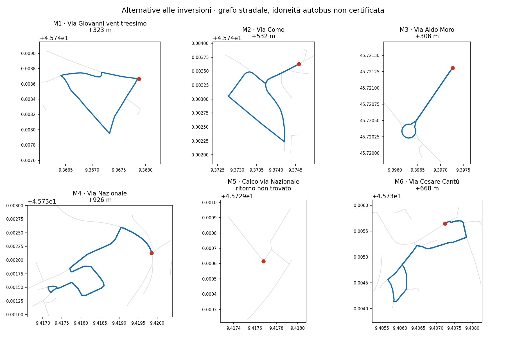

# Linea 8 — alternative stradali alle sei inversioni

**Aggiornamento sul percorso confermato il 1 ottobre 2026:** l'[audit della proposta corrente](RT031_LINEA8_SCHEDA_VERIFICA_OPERATORE_2026_10_01.md) rileva zero inversioni immediate. Le sei M1–M6 e i costi dei cicli alternativi di questo documento si riferiscono a una geometria storica; non si applicano all'attuale percorso da 27,123508 km.

**Aggiornamento successivo:** il [confronto di attraversamento a Calco](RT031_LINEA8_CALCO_ATTRAVERSAMENTO_V3.md) trova un'ipotesi di accosto a 19 m e ricostruisce l'intero percorso senza le sei inversioni intermedie, a 123.413 km/anno. Il confronto qui sotto mantiene invece rigidamente tutti i punti originali.

La verifica dell'orario a 16 giri è passata in CI (commit `22e2f9a`). La verifica stradale successiva trova **cinque percorsi di ritorno senza inversioni immediate**, mentre **Calco–Via Nazionale (M5) resta irrisolta** nel grafo congelato. Nessuna alternativa è adottata o certificata per un autobus.

| Punto | Alternativa al ritorno immediato | Km annui aggiuntivi, 16 giri × 260 giorni |
|---|---:|---:|
| M1 Hoè, Via Giovanni XXIII | 323 m | 1.345 |
| M2 Santa Maria Hoè, Via Como | 532 m | 2.212 |
| M3 Olgiate sud, Via Aldo Moro | 308 m | 1.281 |
| M4 Via Nazionale, punto senza fermata | 926 m | 3.851 |
| M5 Calco–Via Nazionale, sito 27 | Nessun ritorno trovato | Non stimabile |
| M6 San Zeno, Via Cantù | 668 m | 2.779 |

I metri sono **aggiunte al percorso confermato**, non la distanza dalla fermata alla stazione. Per Olgiate sud e San Zeno, sostituendo solo la rispettiva inversione, il tratto rapido verso FS rimane circa **5,01 e 4,73 minuti** nel modello nominale precedente (marcia ×1,1, sosta 0,5 min). Sono tempi condizionali: non comprendono nuovi tempi misurati di accelerazione, frenata o attraversamento della rotatoria.

## Effetto del pacchetto delle cinque alternative disponibili

Inserirle tutte aggiunge **2,757 km per giro**, ossia **11.467,888 km/anno**: il confronto sale da 115.143,267 a **126.611,155 km/anno**, circa **+13,64%** rispetto a 111.419. M5 rimane comunque da risolvere. Questo pacchetto non è una proposta adottata: usare tutte le aggiunte senza verificarne la necessità sul campo amplierebbe troppo il costo.

Il ricontrollo a partenze invariate conserva i 20 abbinamenti dei gruppi ferroviari selezionati e la compatibilità con 18 dei 22 obiettivi precedenti. Le soste intermedie restano temporalmente possibili nei nove scenari comuni. Tuttavia, la garanzia di attesa nelle spalle fallisce per San Zeno verso FS nello stress marcia ×1,1 / sosta 1 min, per persone pronte tra **16:00 e circa 16:02:43**. Quattro mezzi bastano in 22 dei 27 scenari; cinque servono nei restanti cinque. Non è stata cercata una nuova fasatura dell'orario su questa geometria e nessun fallimento viene trasformato in una probabilità empirica.

## Che cosa viene conservato e che cosa resta da decidere

La ricerca conserva il punto di ciascuna inversione, i tratti prima e dopo, la memoria dell'arco in ingresso, le regole via-node rappresentate e gli eventi passeggeri originali nel loro ordine. Gli eventi alla fermata interessata avvengono prima del giro aggiuntivo; gli attraversamenti supplementari dei nodi di fermata **non diventano automaticamente nuovi eventi di servizio**. Non sono permessi ritorni intermedi a FS o inversioni immediate neppure spostate a un altro nodo. Gli archi spezzati alla fermata di Olgiate sud sostituiscono gli archi sovrapposti originali, per evitare falsi ritorni dovuti alla segmentazione.

La ricerca è un minimo locale di distanza in questo dominio, non un minimo globale di rete. Non certifica restrizioni dipendenti dalla storia completa, ingombri autobus, spazio di accosto, lati delle paline o continuità operativa dei passeggeri. **Assenza di un ciclo per M5 non significa impossibilità fisica assoluta**: il grafo non rappresenta necessariamente piazzali o manovre autorizzabili.

La proposta istruttoria a 115.143 km resta quindi una base condizionata. Prima di modificarla, occorre verificare se ciascuna inversione originale possa essere eseguita con il mezzo previsto. Per i punti che non superano la verifica, questa mappa fornisce alternative da controllare. M5 richiede verifica specifica della fermata esistente D185 e del suo spazio di manovra; se non risolvibile, un eventuale spostamento dovrà avere una propria verifica di accessibilità e di evento direzionale. Nessuna fermata viene eliminata o spostata automaticamente.

`network_selected=false`, `primary_selection_authorised=false`, `runner_up_selection_authorised=false`. `decision_budget_km` e `uncertainty_band_min` rimangono non dichiarati.

[Risultati machine-readable](../outputs/phase2/rt031_line8_local_shortcuts_v3/manoeuvre_return_cycles.json) · [Geometrie GeoJSON](../outputs/phase2/rt031_line8_local_shortcuts_v3/manoeuvre_return_cycles.geojson) · [Orario istruttorio](RT031_LINEA8_SOSTA_FS_VARIABILE_E_MANOVRE_V3.md)
