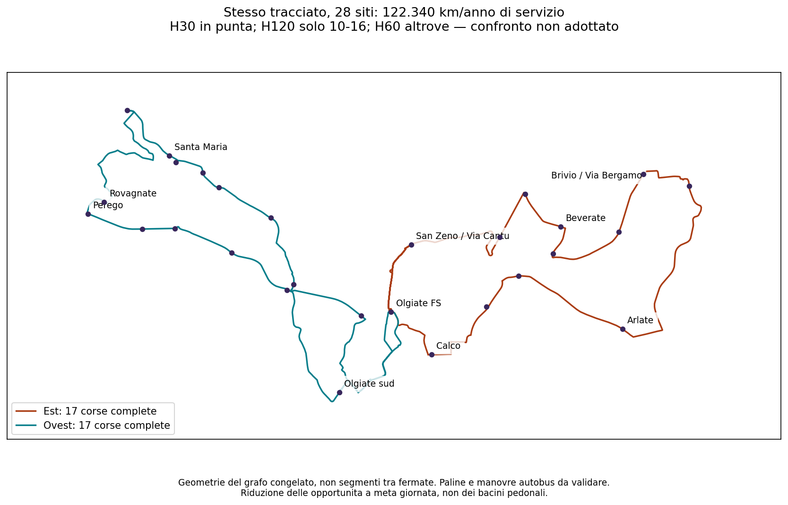

# Linea 8 — precedente proposta a 31 corse d’ala, superata come soluzione finale

**Contratto corretto:** tutte le corse commerciali devono percorrere l’intero otto. I 31 giri d’ala qui documentati non soddisfano quella definizione e non sono più la proposta finale. [Ricostruzione del percorso unico completo](RT031_LINEA8_PERCORSO_UNICO_COMPLETO_V3.md).

**Aggiornamento fermate e continuità:** il committente ha accolto la nuova fermata nell’area di Arlate ed escluso l’ipotesi in Via Indipendenza. Il confronto storico comprende **29 siti di progetto**, mantenendo le 31 partenze d’ala e gli stessi km ai soli fini del confronto. Il [confronto sulla continuità intercomunale](RT031_LINEA8_CONTINUITA_INTERCOMUNALE_V3.md) ricontrolla i tempi con Arlate; le tabelle e prove originarie sotto restano riferite ai 28 siti della base precedente. Nessuna prosecuzione a bordo è ancora approvata all’esercizio.

**Scelta del committente registrata: 31 corse e il lieve sforamento dello specifico scenario.** Questa era la base a corse d’ala; sostituiva l’orario da 34 corse e 122.340 km. Geometria invariata. Non è un’autorizzazione all’esercizio né una copertura finanziaria.

## Quadro conclusivo

| Voce | Proposta |
|---|---|
| Produzione | **111.460,883 km di servizio/anno**, con 260 giorni identici ipotizzati |
| Scostamento dal riferimento di 111.419 | **+41,883 km/anno, +0,0376%**; questo specifico scostamento è accettato |
| Corse | **15 ovest + 16 est = 31 al giorno**; ciascuna è un giro completo della propria ala, non un intero otto |
| Geometria | Stesse ali ovest B / est A; stessi 28 siti, inclusi FS e i due punti locali provvisori |
| H30 passeggeri nelle punte | **07–09 e 16:55–18:55**, in entrambi i sensi di viaggio nel modello |
| Prime / ultime partenze FS | **06:30 ovest, 06:35 est / 19:40 entrambe** |
| Massima attesa modellata | **155 minuti ovest; 120 minuti est**; non H120 ovunque e non H60 in tutta la morbida |
| Mezzi | **4 nominali, fino a 6 negli stress**; non sono turni autista o disponibilità certificata |

Il calendario annuale non è ancora adottato. Km di deposito e riposizionamento, costo monetario, paline e manovre non sono compresi nell’approvazione dello scenario chilometrico. La scelta di 31 corse non equivale all’accettazione preventiva di ogni minuto della tabella.

## Partenze da Olgiate FS

Le colonne sono elenchi indipendenti: una riga **non** indica lo stesso autobus o una coincidenza fra ali. Non è garantita la permanenza a bordo attraverso FS.

| N. nell’ala | Ovest: Olgiate sud, La Valletta, Santa Maria | Est: San Zeno, Calco, Arlate, Brivio |
|---|---:|---:|
| 1 | 06:30 | 06:35 |
| 2 | 07:00 | 07:05 |
| 3 | 07:30 | 07:35 |
| 4 | 08:00 | 08:05 |
| 5 | 08:30 | 08:35 |
| 6 | 09:00 | 09:05 |
| 7 | 11:35 | 10:35 |
| 8 | 14:05 | 12:35 |
| 9 | 16:35 | 14:35 |
| 10 | 17:05 | 16:35 |
| 11 | 17:35 | 17:05 |
| 12 | 18:05 | 17:35 |
| 13 | 18:35 | 18:05 |
| 14 | 19:05 | 18:35 |
| 15 | 19:40 | 19:05 |
| 16 | — | 19:40 |

## Il compromesso centrale, senza nasconderlo

- **Ovest:** 09:00 → 11:35 → 14:05 → 16:35: intervalli di **155, 150, 150 minuti**.
- **Est:** 09:05 → 10:35 → 12:35 → 14:35 → 16:35: intervalli di **90, 120, 120, 120 minuti**.
- Prime partenze, punte e ultima partenza non vengono anticipate o accorciate. H60 è ricontrollato nella fascia iniziale 06:30–07 e dopo la punta serale 18:55–19:40.
- Questi intervalli sono tra partenze FS; la verifica aggiuntiva usa gli eventi di ciascun sito verso/dalla stazione e tutti i nove scenari. Il massimo non è un’attesa media né una probabilità di affidabilità.
- La precedente regola «H120 solo 10–16, H60 nel resto» **non vale più**: la riduzione interessa anche la transizione dopo la punta mattutina e prima di quella pomeridiana. Le violazioni di quella vecchia regola sono registrate per sito, direzione e scenario nel file macchina.

I buchi di tre ore dell’esempio ottenuto cancellando corse sono quindi ridotti a **2h35 ovest e 2h est**, agli stessi 111.460,883 km. La copertura geografica resta invariata; l’accessibilità temporale peggiora rispetto alle 34 corse. Non dichiariamo trascurabile la domanda centrale.

### Regolarità e prova di limite

Mattino: ovest **:00/:30**, est **:05/:35**. Dalle 10 entrambe usano **:05/:35**; l’ultima partenza **19:40** è l’eccezione esplicita. Non tutti gli slot sono serviti.

Nel dominio verificato (partenze ogni cinque minuti, 15/16 corse, stessi percorsi, prime/ultime, punte, treni e quattro mezzi nominali) il minimo indipendente del peggior intervallo è **155 minuti ovest e 115 est**. I due minimi sono raggiungibili insieme. Imponendo i minuti regolari della proposta, i minimi diventano **155 e 120** e sono ancora raggiungibili insieme. Quindi la leggibilità costa **5 minuti sul peggior intervallo est**, nessun km e nessun peggioramento ovest. Entrambe le prove sono conservate, senza pesi territoriali né dichiarare unica la tabella scelta. Non è un ottimo su ogni calendario o su partenze continue.

## Coincidenze ferroviarie

Conservati tutti i **297 controlli per sito**: treni verso Milano **07:26, 07:56, 08:26, 08:56, 09:26**; arrivi da Milano **16:32, 17:02, 17:32, 18:02, 18:32, 19:32**. **06:56 non è fra gli obiettivi garantiti dal modello.**

Fonte: [GTFS ufficiale Regione Lombardia/Trenord](https://dati.lombardia.it/download/3z4k-mxz9/application%2Fzip), riscaricato il 27 settembre, eventi attivi del 28 settembre 2026 e minuti confrontati fino al 2 ottobre. Tre minuti di trasferimento sono un’ipotesi ingegneristica, non una garanzia su ritardi reali o sul calendario dell’anno. Le altre coincidenze sono descritte, non tutte promesse.

| Partenza centrale FS | Ultimo arrivo da Milano utilizzabile | Attesa treno→bus | Rientro FS nominale | Primo treno verso Milano dopo il giro in tutta la griglia |
|---|---:|---:|---:|---:|
| Est 10:35 | 10:32 | 3 min | 11:15 | 11:26 |
| Ovest 11:35 | 11:32 | 3 min | 12:16 | 12:56 |
| Est 12:35 | 12:32 | 3 min | 13:15 | 13:26 |
| Ovest 14:05 | 14:02 | 3 min | 14:46 | 15:26 |
| Est 14:35 | 14:32 | 3 min | 15:15 | 15:26 |

## Territorio e tracciato: nessun nuovo taglio

Bacini pedonali potenziali a 10 minuti invariati: **Olgiate 84,56%; Calco 68,21%; Brivio 89,09%; Santa Maria Hoè 95,75%; La Valletta Brianza 67,85%**. Sono le metriche territoriali ereditate della stessa geometria, non percentuali di passeggeri o di servizio disponibile a ogni ora. I 28 siti comprendono due punti locali ipotetici: non sono 28 paline già autorizzate. Olgiate sud e San Zeno restano distinti.

## Stato da conservare per una futura presentazione

**Definito come base di progetto:** geometria confermata, 31 corse, specifico scostamento chilometrico accettato, tabella completa e controlli riproducibili. Nessun contatto con Agenzia o operatore effettuato.

**Esplicito compromesso della tabella proposta:** massimo 155 minuti ovest e 120 est, con orario centrale più diradato anche fuori dal precedente intervallo 10–16. La scelta di conservare i minuti regolari rispetto al caso est da 115 minuti è esposta, non nascosta.

**Prima dell’attivazione, non motivo per riaprire ora tutto il progetto:** calendario effettivo, tempi osservati, turni/flotta/deposito, sei manovre, restrizioni complete, paline e interscambio fisico, copertura economica e aggiornamento ferroviario alla data d’avvio. Nessuna garanzia empirica di affidabilità o di permanenza a bordo fra corse. Le limitazioni di viaggio della geometria accettata restano note.

[Decisione del committente](../config/rt031_31_trip_service_authorisation_v3.json) · [Orario, prove e registro eventi](../outputs/phase2/rt031_line8_local_shortcuts_v3/approved_31_trip_timetable.json) · [Coincidenze per tutte le corse](../outputs/phase2/rt031_line8_local_shortcuts_v3/approved_31_trip_rail_connections.json) · [Precedente confronto a 34 corse](RT031_LINEA8_ORARIO_DI_PROGETTO_V3.md)
