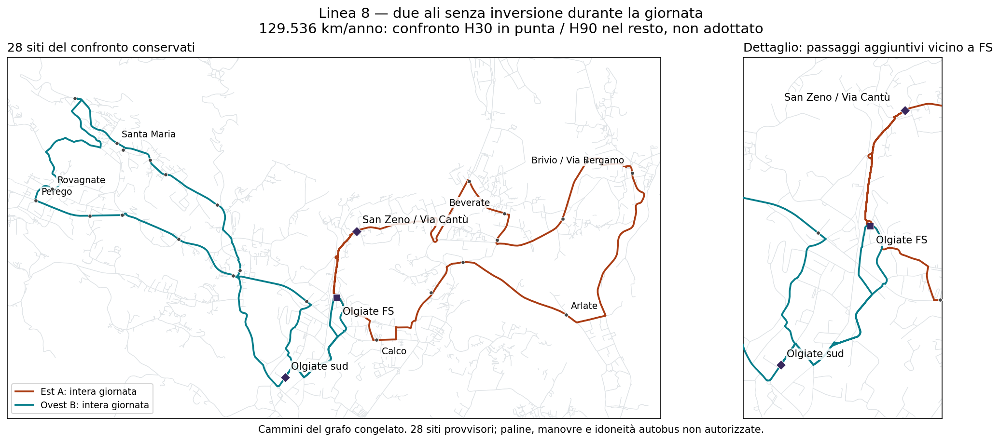

# Linea 8 — orario congiunto, servizio serale e mezzi

## Risultato concreto

**Il fabbisogno nominale di sei-sette mezzi delle riparazioni precedenti non era inevitabile.** Lasciando libere le partenze e cercando insieme frequenze, fasi delle punte e occupazione dei mezzi, troviamo un testimone con collegamenti locali brevi nei due versi, **36 corse, 129.536 km/anno e quattro mezzi nel caso nominale**. Alcuni stress ne richiedono sei: quattro non è una garanzia operativa in ogni condizione.

Il risultato usa **ovest B ed est A per tutta la giornata**, senza cambiare orientamento fra mattino e pomeriggio. Nessun sito geografico del riferimento viene eliminato. Non è una rete selezionata e non autorizza H90, un nuovo budget o fermate fisiche.



## Che cosa offre questo testimone

- **28 siti incluso FS:** 25 siti non-hub derivati dall'inventario, due siti ipotetici nuovi — Olgiate sud e San Zeno/Via Cantù — e il nodo FS. Non sono 28 paline autorizzate. Non si afferma che tutte le frazioni della lista politica iniziale siano pienamente coperte.
- Prime partenze FS **06:30 ovest / 06:35 est**; ultime partenze **20:40 entrambe**. Ultimo ritorno nominale FS **21:21:23**, non rientro in deposito.
- Attesa massima modellata di **30 minuti nelle finestre comuni 07–09 e 16:35–18:35**, nei due versi e in tutti i nove casi marcia/sosta. Sono fasi del confronto, non una preferenza approvata.
- Nel resto, attesa massima modellata di **90 minuti**, non H60. Gli orari non sono tutti cadenzati allo stesso minuto: “H30/H90” qui è un limite all'attesa, non ancora un orario pubblico perfettamente regolare e memorabile.
- Per i due siti locali, tempi nominali disponibili sul bus: **Olgiate sud 4,1–4,3 minuti**, **San Zeno 2,5–2,6 minuti**, nei due versi. Non comprendono cammino o attesa. Verso FS vengono contati esclusivamente gli ultimi passaggi locali prima del ritorno in stazione: non facciamo valere per H30 un passaggio iniziale seguito dal giro lungo.
- **Quattro mezzi** nel caso +10% marcia, 30 secondi per evento di fermata, recupero di 10 minuti per corsa d'ala. È una concatenazione condizionale di corse, non un turno autista validato o una garanzia con ritardi reali. Il massimo nella griglia 9×3 è **sei**.
- Cinque treni mattutini obiettivo **07:26–09:26** e sette arrivi pomeridiani/serali del giorno congelato vengono mantenuti nel modello. L'orario ferroviario **3 settembre 2026 non è quello corrente certificato**; il primo obiettivo 06:56 non viene ripristinato.

## Chilometri: conto esplicito, senza cambiare calendario

| Componente | Lunghezza per corsa | Corse al giorno | Km al giorno |
|---|---:|---:|---:|
| Ovest B | 14,163015 km | 18 | 254,934279 |
| Est A | 13,515654 km | 18 | 243,281779 |
| Totale | — | 36 | **498,216058** |

**498,216058 × 260 giorni = 129.536,175 km/anno di servizio.** È **+18.117,175 km / +16,26%** rispetto a 111.419. Non è un piccolo sforamento implicitamente approvato. Deposito, riposizionamenti, costi del personale e calendario annuale effettivo rimangono fuori da questo conto.

## Confronto con H60 e con il percorso precedente

Qui si confrontano i casi con **limite nominale di quattro mezzi**. Tutti mantengono i 28 siti del riferimento; il precedente conserva viaggi locali lunghi nel controflusso e su alcune corse fuori punta, quindi non risolve tutta la richiesta di qualità locale.

| Percorso | Fuori punta | Corse/giorno | Km/anno | Scostamento da 111.419 | Mezzi nominali / massimo stress |
|---|---:|---:|---:|---:|---:|
| Precedente, problema locale non risolto | H90 | 37 | 119.084 | +6,88% | 4 / 5 |
| Precedente, problema locale non risolto | H60 | 42 | 134.926 | +21,10% | 4 / 5 |
| Collegamenti locali brevi nei due versi | H90 | 36 | **129.536** | **+16,26%** | **4 / 6** |
| Collegamenti locali brevi nei due versi | H60 | 42 | 151.126 | +35,64% | 4 / 5 |

Il confronto a cinque mezzi nominali trova 119.056,611 km sul precedente H90 e 134.758,009 sul precedente H60; sul percorso locale corretto i minimi chilometrici restano uguali. Non mescoliamo risparmio km e numero di mezzi con pesi arbitrari: tutti gli otto risultati sono conservati nel file macchina.

Il solver ha concluso con ottimo nei rispettivi **domini finiti dichiarati**, non sull'intero problema stradale o su tutti gli orari continui. Le soluzioni sono ricontrollate indipendentemente, anche quando una futura esecuzione si arrestasse al limite di tempo: un timeout senza soluzione non equivale a impossibilità.

## Orario completo del testimone da 129.536 km

I ritorni FS sono tempi di modello, non precisione osservata al secondo. I numeri dei mezzi sono identificativi di blocchi condizionali: cambiare ala con lo stesso mezzo **non promette continuità del servizio passeggeri**. Recupero minimo incluso nel blocco: 10 minuti dopo ogni corsa d'ala.

| Corsa | Partenza FS | Percorso | Km | Ritorno FS nominale | Blocco mezzo |
|---|---|---|---:|---|---:|
| T01 | 06:30 | Ovest B | 14,163 | 07:11:23 | 1 |
| T02 | 06:35 | Est A | 13,516 | 07:14:40 | 2 |
| T03 | 07:00 | Ovest B | 14,163 | 07:41:23 | 3 |
| T04 | 07:05 | Est A | 13,516 | 07:44:40 | 4 |
| T05 | 07:30 | Ovest B | 14,163 | 08:11:23 | 2 |
| T06 | 07:35 | Est A | 13,516 | 08:14:40 | 1 |
| T07 | 08:00 | Ovest B | 14,163 | 08:41:23 | 4 |
| T08 | 08:05 | Est A | 13,516 | 08:44:40 | 3 |
| T09 | 08:30 | Ovest B | 14,163 | 09:11:23 | 1 |
| T10 | 08:35 | Est A | 13,516 | 09:14:40 | 2 |
| T11 | 09:00 | Ovest B | 14,163 | 09:41:23 | 3 |
| T12 | 09:05 | Est A | 13,516 | 09:44:40 | 4 |
| T13 | 10:20 | Ovest B | 14,163 | 11:01:23 | 3 |
| T14 | 10:35 | Est A | 13,516 | 11:14:40 | 2 |
| T15 | 11:35 | Ovest B | 14,163 | 12:16:23 | 2 |
| T16 | 12:05 | Est A | 13,516 | 12:44:40 | 3 |
| T17 | 13:05 | Ovest B | 14,163 | 13:46:23 | 4 |
| T18 | 13:15 | Est A | 13,516 | 13:54:40 | 3 |
| T19 | 14:35 | Ovest B | 14,163 | 15:16:23 | 4 |
| T20 | 14:40 | Est A | 13,516 | 15:19:40 | 2 |
| T21 | 16:05 | Ovest B | 14,163 | 16:46:23 | 2 |
| T22 | 16:10 | Est A | 13,516 | 16:49:40 | 4 |
| T23 | 16:35 | Ovest B | 14,163 | 17:16:23 | 3 |
| T24 | 16:40 | Est A | 13,516 | 17:19:40 | 1 |
| T25 | 17:05 | Ovest B | 14,163 | 17:46:23 | 4 |
| T26 | 17:10 | Est A | 13,516 | 17:49:40 | 2 |
| T27 | 17:35 | Est A | 13,516 | 18:14:40 | 1 |
| T28 | 17:35 | Ovest B | 14,163 | 18:16:23 | 3 |
| T29 | 18:05 | Est A | 13,516 | 18:44:40 | 2 |
| T30 | 18:05 | Ovest B | 14,163 | 18:46:23 | 4 |
| T31 | 18:35 | Est A | 13,516 | 19:14:40 | 3 |
| T32 | 18:35 | Ovest B | 14,163 | 19:16:23 | 1 |
| T33 | 19:35 | Est A | 13,516 | 20:14:40 | 1 |
| T34 | 19:35 | Ovest B | 14,163 | 20:16:23 | 3 |
| T35 | 20:40 | Est A | 13,516 | 21:19:40 | 4 |
| T36 | 20:40 | Ovest B | 14,163 | 21:21:23 | 2 |

## Copertura territoriale: conservata, non domanda prevista

I siti sono gli stessi del riferimento completo, quindi resta la sua copertura pedonale potenziale congelata. Nessuna nuova percentuale di utenza viene dedotta dall'orario.

| Comune | Accesso potenziale entro 10 minuti a piedi |
|---|---:|
| Brivio | 89,09% |
| **Calco** | **68,21%** |
| Olgiate Molgora | 84,56% |
| Santa Maria Hoè | 95,75% |
| La Valletta Brianza | 67,85% |
| Totale cinque comuni | 79,16% |

Fonte e limiti: [confronto di copertura già riprodotto](RT031_LINEA8_COMPROMESSI_COPERTURA_E_KM_V3.md). Sono misure sulla matrice territoriale congelata e su siti ipotetici, non persone che useranno il bus, domanda OD assegnata alle corse o copertura temporale garantita. Non equivalgono alla certificazione di tutta la zona residenziale cerchiata dall'utente.

## Esatto dominio della ricerca

- Quattro percorsi d'ala già ricavati dal grafo, nessuna nuova strada inventata; 708 corse candidate, partenze ogni cinque minuti fra 06:00 e 20:40. Nessun numero di corse né cambio unico di orientamento imposto.
- Copertura continua degli istanti di disponibilità passeggero 06:30–20:40; questa fascia di controllo non è una promessa di prima partenza alle 06:30 da ogni fermata.
- Due ore comuni di punta con inizio AM fra 06:30–07:00 e PM fra 16:30–17:00, su griglia di cinque minuti; H60 e H90 distinti. La verifica degli intervalli è continua, non solo ai punti della griglia.
- Copertura simultanea nei nove casi marcia × sosta. Occupazione dei mezzi ottimizzata nel caso nominale, poi controllo dei 27 casi compreso recupero 5/10/15 minuti.
- Coincidenze su dati congelati. Per AM il massimo residuo d'attesa dopo tre minuti di cammino è ereditato dal peggiore residuo del testimone precedente attraverso ali e scenari: 32,294657 minuti sul precedente e 27,815421 sul corretto. È un confronto ingegneristico esplicito, non una soglia politica approvata. Per gli arrivi ferroviari PM 16:32, 17:02, 17:32, 18:02, 18:32, 19:32, 20:32, il bus deve partire 3–8 minuti dopo. I pattern eleggibili conservano le direzioni locali brevi; sul percorso corretto entrambi gli orientamenti le offrono.
- Il minimo di mezzi mediante occupazione è valido soltanto perché tutti i raccordi FS rappresentati risultano compatibili. È ricontrollato con concatenazione delle corse. Non estende tale compatibilità alla legalità completa dipendente dalla storia o alle manovre reali.

## Cosa non è ancora chiuso

La parte tecnica ora produce un orario completo e controllabile. Rimangono **la scelta esplicita fra H60 e H90, il divario di budget, la regolarità/memorizzabilità dell'orario pubblico e la validazione operativa**: paline direzionali e accessibilità, percorribilità autobus e restrizioni complete, tempi osservati, treni correnti, mezzi disponibili, turni e deposito. La conservazione geografica non sana questi punti.

Non è dichiarata una proposta conforme a tutto. `network_selected`, `primary_selection_authorised`, `runner_up_selection_authorised` restano `false`; `decision_budget_km`, `uncertainty_band_min`, `approved_uplift_percent` e costo chilometrico totale restano non scelti/non noti.

## File utilizzabili

- [Otto risultati della ricerca, con orari, limiti e blocchi dei mezzi](../outputs/phase2/rt031_line8_local_shortcuts_v3/joint_evening_timetable.json).
- [Conto delle 36 corse e passaggi per ogni occorrenza di fermata](../outputs/phase2/rt031_line8_local_shortcuts_v3/joint_evening_witness.json).
- [Tracciato GeoJSON dei soli due percorsi usati](../outputs/phase2/rt031_line8_local_shortcuts_v3/joint_evening_witness.geojson).
- [Solver](../scripts/phase2_solve_rt031_line8_joint_evening_v3.py), [esportatore](../scripts/phase2_export_rt031_line8_joint_evening_v3.py), [test indipendenti](../tests/test_phase2_rt031_line8_joint_evening_v3.py).

```powershell
$env:PYTHONPATH='.;src'
python -m scripts.phase2_solve_rt031_line8_joint_evening_v3 --time_limit 45
python -m scripts.phase2_export_rt031_line8_joint_evening_v3
python -m unittest discover -s tests -p test_phase2_rt031_line8_joint_evening_v3.py
```

In presenza di ottimi a pari km, un'altra versione del solver può produrre orari diversi. I test verificano gli orari salvati indipendentemente dall'ottimizzatore. Il testimone illustrato resta identificato dalla sua chiave e non diventa una selezione per il solo fatto di essere esportato.
