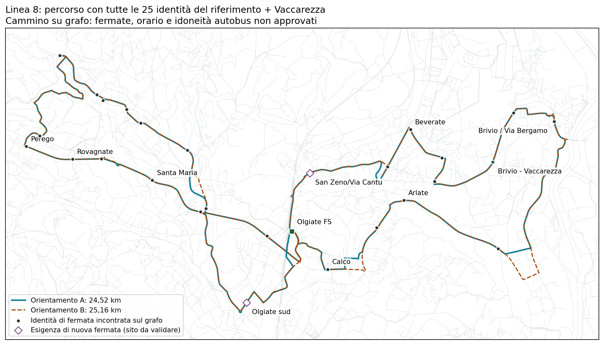

# Linea 8 — orario ricalibrato, stessi percorsi e stessi chilometri

## Risultato e scelta ancora aperta

È costruito un confronto con **36 corse d'ala al giorno, 115.800,435 km di servizio/anno su 260 giorni ipotetici**: +4.381,435 km (+3,93%) rispetto al riferimento di 111.419. Si spostano dodici corse; non si aggiungono corse e non si cambiano percorsi o siti serviti. Deposito e riposizionamenti sono esclusi: il costo complessivo non è ancora noto.

Il ricalcolo elimina gli intervalli superiori a 60 minuti nel controllo ottimistico per identità in tutti i 27 scenari deterministici esaminati. Mantiene cinque partenze a distanza di 30 minuti in ciascun gruppo di punta e le nuove coincidenze mattutine. **Il compromesso è esplicito: il primo treno mattutino mantenuto nell'intera griglia diventa quello delle 07:26, non quello delle 06:56.** Non è un miglioramento su obiettivi ferroviari immutati e non viene adottato automaticamente.

## Partenze da Olgiate FS nel confronto

| Gruppo | Ala ovest | Ala est |
|---|---|---|
| Mattina, cinque corse H30 | 06:34, 07:04, 07:34, 08:04, 08:34 | 06:27, 06:57, 07:27, 07:57, 08:27 |
| Cambio di orientamento | 08:55 | 08:48 |
| Morbida, otto corse H60 | 09:40–16:40, ogni ora | 09:40–16:40, ogni ora |
| Completamento punta serale | 17:10, 17:40, 18:10, 18:40 | 17:10, 17:40, 18:10, 18:40 |

La punta serale comprende anche le 16:40: cinque partenze H30. Il mattino usa `west_A/east_B`; dopo il cambio usa `west_B/east_A`. Le due ali appartengono al concetto di una linea unica, ma questo calcolo non certifica continuità passeggeri sullo stesso veicolo fra ali.

La prima e l'ultima partenza complessiva da FS distano **12 ore e 13 minuti**: non sono una fascia di 13–14 ore garantita a ogni fermata. Cinque partenze H30 a ogni occorrenza non certificano due ore comuni di attesa massima 30 minuti in entrambi i versi: gli esiti negativi di quel controllo sono conservati nell'artefatto.

## Beneficio locale e limite che rimane

| Località | Mattina verso FS | Dopo il cambio, da FS | Verso opposto |
|---|---:|---:|---|
| Olgiate sud | 4,1 min | 4,3 min | Circa 31 min |
| San Zeno / Via Cantù | 2,6 min | 2,5 min | Circa 31–32 min |

Sono tempi a bordo modellati (+10% marcia, 30 secondi di sosta), senza accesso a piedi o attesa. **Il problema del giro lungo nel controflusso non è risolto.** Il beneficio è direzionale: verso la stazione al mattino e dalla stazione dopo il cambio. Percorsi, 28 identità/siti inclusa FS e copertura territoriale potenziale sono invariati; non sono 28 paline autorizzate.

## Verifiche e risorse

- Nove combinazioni di marcia (0,9 / 1 / 1,1) e sosta (0 / 0,5 / 1 minuto), ciascuna con recuperi di 5 / 10 / 15 minuti: **27 scenari**, non probabilità di affidabilità osservata.
- Intervalli al massimo H60 fra opportunità aggregate per identità in tutti gli scenari. Piattaforme, attraversamenti e utilizzabilità delle singole occorrenze restano da validare.
- Cinque treni verso Milano, **07:26–09:26**, mantenuti da entrambe le ali nella griglia, assumendo tre minuti di trasferimento. Margine residuo minimo: circa 6 minuti ovest e 14 est. Nel caso +10% / 30 secondi le attese totali fra arrivo bus e partenza treno sono circa 16,5 e 23,5 minuti: anche questo è un costo per il passeggero.
- Orari ferroviari congelati al **3 settembre 2026**, non verifica dell'orario oggi applicabile. Il gruppo serale è invariato rispetto al confronto precedente.
- **Quattro mezzi** nel caso +10% / 30 secondi, con tutti e tre i recuperi; **cinque in alcuni scenari di stress**. Sono blocchi condizionali sul grafo, non turni operatore completi né minimo fra tutti gli orari possibili.

## Perché non conservare semplicemente anche il primo treno delle 06:56?

Per questa precisa struttura (cinque corse mattutine seguite da tredici nell'altro orientamento, inclusa la punta serale), un limite necessario continuo mostra un conflitto sull'ala ovest: conservare le 06:56 in tutta la griglia, H60 durante il cambio e gli altri intervalli, permetterebbe un'ultima partenza non oltre le 18:31:51. Per ricevere il treno delle 18:32 con tre minuti di trasferimento servono almeno le 18:35. Mancano circa **3 minuti e 9 secondi**. Non è una prova d'impossibilità per altri percorsi, corse aggiunte, orientamenti intercalati o tempi osservati più brevi.

## Stato della proposta

Questo è un orario costruito e riproducibile, non un vincitore selezionato. La versione precedente rimane disponibile. Prima di chiamarlo proposta operativa definitiva occorrono accordo sulla fascia ferroviaria e sullo sforamento complessivo, verifica delle fermate e dei percorsi per autobus, tempi osservati e turni/costi dell'operatore. Non si cambia unilateralmente il budget.

Artefatto: [peak_direction_retimed.json](../outputs/phase2/rt031_line8_local_shortcuts_v3/peak_direction_retimed.json), con tutte le corse, dodici variazioni, passaggi per occorrenza, scenari e limite necessario. Generatore: `scripts/phase2_retime_rt031_line8_peak_direction_v3.py`; test: `tests/test_phase2_rt031_line8_retiming_v3.py`.

`network_selected=false`; `primary_selection_authorised=false`; `runner_up_selection_authorised=false`; `decision_budget_km=null`; `uncertainty_band_min=null`.
