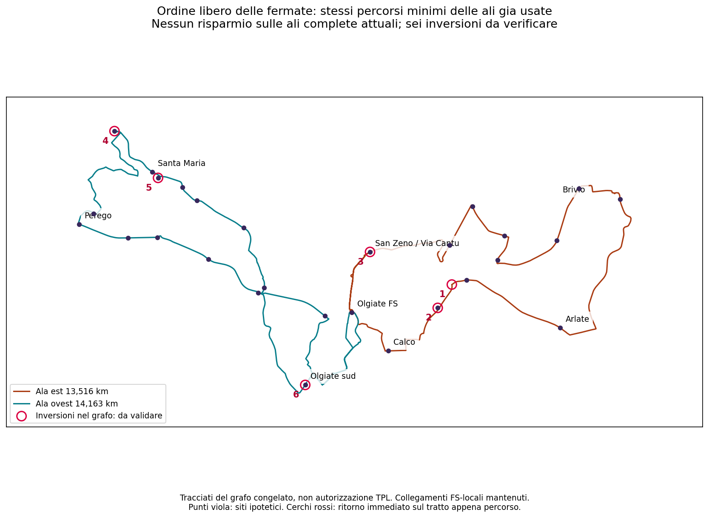

# Linea 8 — tutti gli ordini interni delle fermate

## Esito

**Non emerge un percorso completo piu corto di quelli gia usati.** Il minimo stradale con ordine interno libero coincide, arco per arco, con **ovest B ed est A**, le due ali complete dell'ultimo testimone da 141.064,938 km/anno. Non sono nuovi km risparmiati e non e un nuovo orario.

| Ala di partenza | Minimo nel dominio | Risparmio sul percorso di partenza | Percorso ricostruito |
|---|---:|---:|---|
| Est A, gia usata | 13,515654 km | 0 m | Est A identica |
| Est B | 13,515654 km | 720,234 m | Est A identica |
| Ovest A | 14,163015 km | 72,935 m | Ovest B identica |
| Ovest B, gia usata | 14,163015 km | 0 m | Ovest B identica |

I risparmi delle altre righe riguardano orientamenti non usati dalle corse complete dell'ultimo testimone: **non vanno sottratti dai 141.065 km**. Non cambiano H30/H60, calendario o fermate di quel testimone.

## Dominio e prova

Per ciascuna ala: conservazione dei suoi siti, tutti gli ordini dei nodi interni ammessi, passaggi ripetuti ammessi, nessun rientro intermedio a FS. Restano fissati il percorso FS-prima occorrenza locale e ultima occorrenza locale-FS, preservando i collegamenti locali brevi di Olgiate sud e San Zeno.

La ricerca considera 14 nodi interni/33 stati di arrivo per ovest e 11 nodi/27 stati per est. Le distanze fra terminali conservano l'arco diretto di arrivo: non azzerano le restrizioni ad ogni fermata. La programmazione dinamica su sottoinsiemi trova il minimo esatto per le restrizioni via-node rappresentate. Ricostruzione e controllo successivo verificano continuita, eventi, siti conservati, costi e giunzioni a FS. Gli incontri incidentali sono ricostruiti sul cammino effettivo.

Non e un minimo di esercizio fra tutti gli ordini: percorsi piu lunghi potrebbero distribuire diversamente tempi e qualita dei viaggi. Non e una prova su altri punti fermata o collegamenti locali. Non estende la precedente ottimalita dell'orario oltre i suoi 64 cammini. Nessuna restrizione full-history certificata e nessuna probabilita empirica di affidabilita dedotta.

## Sei punti concreti di verifica fisica

I tracciati minimi, identici a quelli gia usati, contengono sei ritorni immediati lungo l'arco appena percorso. I numeri corrispondono ai cerchi sulla mappa.

| Punto | Ala | Latitudine | Longitudine |
|---|---|---:|---:|
| 1 | Est | 45,7321292 | 9,4198545 |
| 2 | Est | 45,7296151 | 9,4176798 |
| 3 | Est | 45,7356450 | 9,4072469 |
| 4 | Ovest | 45,7486662 | 9,3678712 |
| 5 | Ovest | 45,7436272 | 9,3745828 |
| 6 | Ovest, punto virtuale Olgiate sud | 45,7213100 | 9,3972651 |

**Non sono sei inversioni autorizzate per autobus.** Spezzare un arco stradale per rappresentare il sito di Olgiate sud non crea fisicamente uno spazio di manovra. Per ogni punto occorre verificare se esista una manovra utilizzabile o quale giro stradale occorra al suo posto. Non attribuiamo penalita chilometriche inventate e non eliminiamo automaticamente tutti i ritorni.

Il GeoJSON riporta nodo, archi di ingresso/uscita, indice dell'occorrenza e siti coincidenti, con `bus_manoeuvre_authorised=false`. Restano aperte anche le restrizioni full-history/via-way, l'idoneita autobus e le paline.

## Conseguenza

La pista «stessi siti e stessi collegamenti locali, soltanto un ordine piu corto» e ora verificata nel dominio dichiarato, non semplicemente campionata. Restano **141.065 km di servizio**, +26,61% su 111.419, prima degli extra: non una proposta conforme a tutto o pronta all'esercizio.

La priorita tecnica e risolvere i punti fisici e ricalcolare eventuali cammini correttivi. Il controllo puo aumentare il costo; non promette il rientro nel budget. Nessuna selezione, soglia di sforamento, perdita territoriale o riduzione di frequenza adottata.

`decision_budget_km=null`, `uncertainty_band_min=null`, `network_selected=false`, `primary_selection_authorised=false`, `runner_up_selection_authorised=false`.

## Riproduzione

`scripts/phase2_probe_rt031_line8_free_orders_v3.py --graph_dir <grafo congelato>` verifica gli hash delle fonti. `scripts/phase2_export_rt031_line8_free_orders_v3.py` esporta la mappa. Artefatti: `outputs/phase2/rt031_line8_local_shortcuts_v3/free_order_road_comparison.json`, `.geojson`, `.png`.

`tests/test_phase2_rt031_line8_free_orders_v3.py`: confronto indipendente contro ricerca esaustiva sul prodotto (insieme visitato, ultimo arco), restrizioni alle giunzioni, visite incidentali, nodi duplicati, fallimento su costi invalidi e identita dei percorsi ricostruiti con quelli di riferimento.
