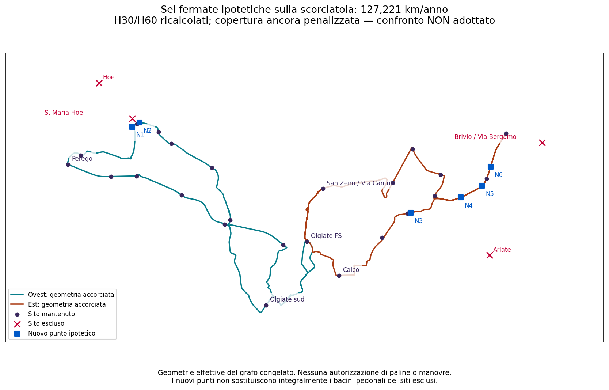

# Linea 8 — piu fermate sulle scorciatoie: copertura e orario ricalcolati

## Esito

**Aggiungere fermate alla scorciatoia piu economica non basta a conservare la copertura richiesta.** Esaminati **878 nodi stradali** non gia serviti, comuni ai due orientamenti di ciascuna ala: non soltanto i nuovi tratti delle scorciatoie e non piu una sola fermata per ala.

Un testimone con **sei nuovi punti ipotetici** recupera tutti i nuclei precedentemente coperti che risultano recuperabili in questo dominio alle soglie 5/8/10 minuti. Sei e il minimo numero di aggiunte per questo preciso obiettivo spaziale, non il minimo operativo o una scelta autorizzata. Restano perdite rilevanti.

**Orario ricalcolato: 127.220,618 km/anno di servizio, +14,18% su 111.419.** H30 in punta/H60 nel resto, 41 corse d'ala al giorno, quattro mezzi nominali/fino a sei negli stress. Non e la proposta finale: non compensa il peggioramento territoriale.

## Quante persone restano raggiungibili a piedi

Copertura pedonale potenziale entro dieci minuti, con pesi di popolazione congelati; non domanda passeggeri o accessibilita autorizzata:

| Comune | Proposta estesa di riferimento | Scorciatoia + sei punti | Differenza |
|---|---:|---:|---:|
| Brivio | 89,09% | 71,25% | −17,84 pp |
| Calco | 68,21% | 56,63% | −11,58 pp |
| Olgiate Molgora | 84,56% | 84,56% | 0,00 pp |
| Santa Maria Hoe | 95,75% | 91,89% | −3,86 pp |
| La Valletta Brianza | 67,85% | 67,85% | 0,00 pp |

Totale dei cinque comuni: circa **72,65%**, contro 79,16% del riferimento esteso. I siti diventano **31**, ma la copertura peggiora: il numero delle fermate non misura da solo l'utilita territoriale.

Anche ammettendo un punto di salita in **tutti gli 878 nodi**, senza alcun costo di sosta, la copertura massima a dieci minuti su queste geometrie sarebbe 71,35% a Brivio e 60,94% a Calco. La perdita *lorda* di popolazione prima coperta resta rispettivamente 19,19 e 11,58 punti: i nuovi nuclei raggiunti non restituiscono l'accesso a quelli esclusi. Per Santa Maria Hoe la perdita lorda resta 3,86 punti. Il JSON distingue saldo, perdita lorda e massimo teorico del dominio.

Questo limite vale **solo per quei nodi, su quelle due geometrie e con quegli agganci pedonali**, non per ogni posizione continua lungo strada o qualsiasi altro tracciato.

## Dove sarebbero i nuovi punti

| Punto | Latitudine | Longitudine |
|---|---:|---:|
| N1 | 45,7432776 | 9,3737337 |
| N2 | 45,7438034 | 9,3749847 |
| N3 | 45,7326843 | 9,4226695 |
| N4 | 45,7345735 | 9,4314672 |
| N5 | 45,7360084 | 9,4351980 |
| N6 | 45,7383645 | 9,4367518 |

Sono posizioni di calcolo, **non sei fermate da realizzare**. Alcune sono vicine tra loro: minimizzare il numero necessario per recuperare precisamente i nuclei alle tre soglie non equivale a progettare una spaziatura ragionevole, marciapiedi o attraversamenti sicuri. Ogni punto viene legato alle reali occorrenze dei percorsi, senza autorizzare paline o salita.

## Perche i km crescono anche se il tracciato non cambia

Il precedente estremo senza nuovi punti costava **121.340,751 km/anno**. Le sei aggiunte non modificano gli archi stradali, ma aggiungono soste nel modello. Riottimizzando l'orario con tutte le soste, H30/H60 e gli obiettivi ferroviari, il testimone passa da 39 a **41 corse d'ala**: **+5.879,866 km/anno**. Non abbiamo applicato automaticamente ai nuovi punti il vecchio costo chilometrico.

Il minimo e provato per **questo testimone di posizionamento**, i quattro percorsi, le punte fissate 06:50–08:50/16:35–18:35, la fascia passeggeri 06:30–19:40 e i 260 giorni ipotizzati. Sono ricontrollati nove scenari di marcia/sosta e 330 obiettivi ferroviari per sito. Non e il minimo fra tutte le disposizioni equivalenti delle sei fermate. Treni ancora congelati, non aggiornati; nessuna probabilita empirica di affidabilita dedotta.

## Conseguenza progettuale

Questa scorciatoia **non puo essere presentata come sostituto territorialmente equivalente** dell'ala che raggiunge Arlate e Brivio. Inserire piu fermate lungo le strade tagliate non risolve la distanza dai nuclei esclusi. Per recuperare quei bacini serve esaminare geometrie diverse, non soltanto moltiplicare i punti sulla stessa scorciatoia.

Nessun taglio territoriale, aumento del budget o rete scelti. Rimane distinta la proposta estesa da 141.065 km; questo confronto piu economico non la sostituisce automaticamente. Restano da validare idoneita autobus, manovre, restrizioni full-history, paline, calendario, deposito e costi totali.

`network_selected=false`, `primary_selection_authorised=false`, `runner_up_selection_authorised=false`; `decision_budget_km=null`, `uncertainty_band_min=null`, `total_operating_km=null`.

## Riproduzione e controlli

Script `phase2_probe_rt031_line8_multistop_recovery_v3.py` con `--graph_dir` e `--walk_dir` congelati; poi `phase2_check_rt031_line8_multistop_recovery_v3.py` e `phase2_export_rt031_line8_multistop_recovery_v3.py`, nella cartella `scripts/`. Artefatti omonimi `multistop_recovery.*` e `multistop_recovery_timetable.json` in `outputs/phase2/rt031_line8_local_shortcuts_v3/`.

Controlli: hash delle fonti, Dijkstra multi-origine con costi dei connettori e direzione pedonale, confronto del problema di copertura con enumerazione esaustiva su casi piccoli, perdite irrecuperabili non eliminate, stessi archi stradali e nuovi eventi reali, ricontrollo indipendente di frequenze/treni/flotta dopo le soste.
