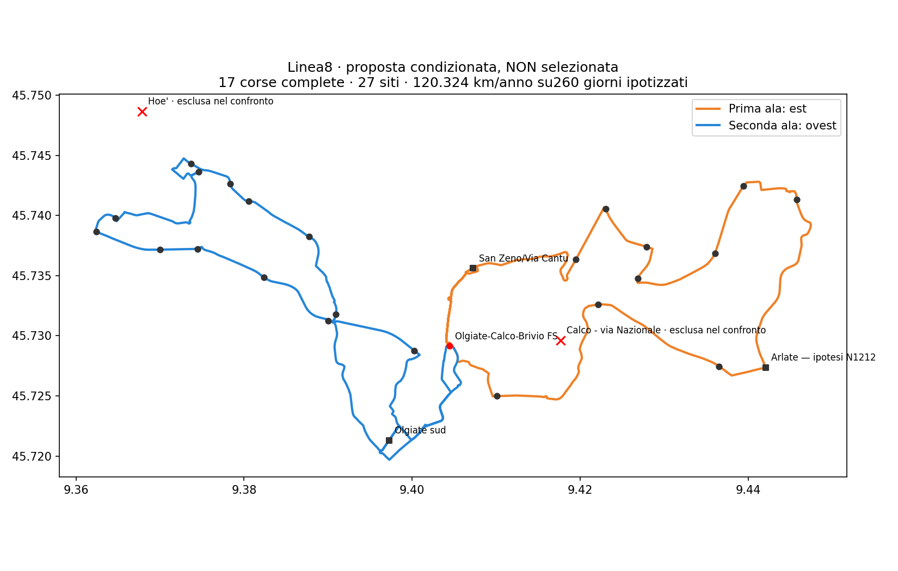

# Linea 8 — scheda unica di proposta condizionata

Una sola scheda consolida il confronto già mostrato: **17 corse complete al giorno, 27 siti di progetto, 120.324 km/anno su 260 giorni ipotizzati (+8%)**. Non è una rete selezionata, un aumento di budget autorizzato o un orario pubblicabile. L'esempio est→ovest non è un nuovo vincitore Pareto; l'alternativa ovest→est resta nei confronti sorgente.

## Servizio proposto nell’esempio

Un solo nome pubblico: **Linea 8**. Ogni corsa parte da FS, percorre l’ala est, richiama FS con prosecuzione progettata a bordo, percorre l’ala ovest e torna a FS. Stesso percorso e stesse occorrenze per tutte le 17 corse; nessuna corsa limitata a una sola ala. Le ali non sono due linee. Continuità fisica/operativa e manovra in stazione restano da verificare.

H30 per quattro gruppi ferroviari di cinque treni, con finestre diverse fra le ali; H60 come cap di readiness nelle spalle, H120 solo10–16. Non significa H30 per tutto il giorno, H30 comune alle stesse ore in tutte le frazioni o intervalli esattamente60 minuti per tutta la morbida. I treni sono quelli congelati del modello, non orari odierni verificati.

Finestre di readiness dell’esempio: 06:50–10:00 limite 60 min, 10:00–16:00 limite 120 min, 16:00–19:40 limite 60 min. Per chi è pronto a partire in queste fasce, il modello verifica un’opportunità di viaggio entro quel limite. Sono assunzioni ingegneristiche esplicite, non la fascia di salita identica a ogni fermata.

| Gruppo | Treni archiviati | Partenze dell’ala da FS |
|---|---|---|
| Est → Milano | 06:56–08:56 | 06:05, 06:35, 07:05, 07:35, 08:05 |
| Est ← Milano | 16:02–18:02 | 16:10, 16:40, 17:10, 17:40, 18:10 |
| Ovest → Milano | 07:56–09:56 | 07:00, 07:30, 08:00, 08:30, 09:00 |
| Ovest ← Milano | 17:32–19:32 | 17:35, 18:05, 18:35, 19:05, 19:35 |

## Tutti i27 siti, non27 paline approvate

24 identità di inventario inclusa FS e tre punti proposti: Olgiate sud, San Zeno/Via Cantù e Arlate N1212. I due punti locali hanno ciascuno due occorrenze ordinate per corsa. Posizione/lato di accosto, numero di paline e accessibilità reale sono ancora non approvati. Tempi relativi nominali del passaggio più favorevole, esclusi cammino e attesa iniziale; ledger completo nel JSON.

| Sito | Comune da inventario | Tipo | FS→sito min | Sito→FS min |
|---|---|---|---:|---:|
| Olgiate-Calco-Brivio FS | Olgiate Molgora | Inventario | — | — |
| San Zeno/Via Cantu | Olgiate Molgora | Nuovo punto ipotizzato | 2.54 | 2.91 |
| Calco - via nazionale (peugeot) | Olgiate Molgora | Inventario | 6.95 | 32.56 |
| Brivio - beverate (cariplo) | Brivio | Inventario | 8.41 | 31.10 |
| Brivio - beverate (paese) | Brivio | Inventario | 10.35 | 29.15 |
| Brivio - beverate (quattro strade) | Brivio | Inventario | 11.83 | 27.68 |
| Brivio - Vaccarezza | Brivio | Inventario | 13.76 | 25.74 |
| Brivio - Via Como (pizzeria / Bar Cristallo) | Brivio | Inventario | 15.88 | 23.63 |
| Brivio - Via Bergamo (Scuola Materna) | Brivio | Inventario | 18.02 | 21.48 |
| Arlate — ipotesi N1212 | Calco | Nuovo punto ipotizzato | 21.92 | 17.59 |
| Arlate - Cantina Pirovano | Calco | Inventario | 23.65 | 15.86 |
| Arlate - B.vio Brivio - Madonnina | Calco | Inventario | 27.53 | 11.97 |
| Calco - Via Virgilio | Calco | Inventario | 31.55 | 7.96 |
| Olgiate sud | Olgiate Molgora | Nuovo punto ipotizzato | 4.32 | 4.61 |
| Olgiate Molgora - Scarpone | Olgiate Molgora | Inventario | 8.44 | 30.24 |
| Santa Maria Hoè - Alduno | Santa Maria Hoè | Inventario | 10.25 | 28.43 |
| Rovagnate - Statale / AGIP | La Valletta Brianza | Inventario | 11.90 | 26.79 |
| Rovagnate - Statale / Via Lombardia | La Valletta Brianza | Inventario | 12.98 | 25.70 |
| Perego - Statale / Via S. Caterina | La Valletta Brianza | Inventario | 14.50 | 24.18 |
| Rovagnate - vinicola ghezzi | La Valletta Brianza | Inventario | 15.65 | 23.04 |
| S.Maria Hoe' | Santa Maria Hoè | Inventario | 19.64 | 19.05 |
| Santa Maria Hoè - Via Como / Alpino | Santa Maria Hoè | Inventario | 21.69 | 17.00 |
| Santa Maria Hoè - Tremonte / Via Trento | Santa Maria Hoè | Inventario | 22.97 | 15.72 |
| Santa Maria Hoè - Via Giovanni XXIII / Tremonte-Via Leopardi | Santa Maria Hoè | Inventario | 24.01 | 14.68 |
| S. Maria Hoè - S.P. 58 ang. Via Cenisio | Santa Maria Hoè | Inventario | 25.94 | 12.74 |
| Olgiate Molgora - Via Della Salute | Olgiate Molgora | Inventario | 28.55 | 10.14 |
| Olgiate Molgora - Via Statale | Olgiate Molgora | Inventario | 30.56 | 8.13 |

**Due esclusioni soltanto nell’esempio, non adottate:** Hoè (`FROZEN::300873`) e Calco–via Nazionale (`FROZEN::300634`). La fermata Via Nazionale/Peugeot è una diversa identità conservata; il suo comune è quello dell’inventario, non dedotto dal nome.

## Copertura potenziale dei cinque comuni

| Comune | Entro5min | Entro8min | Entro10min | Perdita5/8/10min, punti percentuali |
|---|---:|---:|---:|---|
| Brivio | 53.59% | 83.31% | 90.18% | 0.00/0.00/0.00 |
| Calco | 26.95% | 54.48% | 70.35% | 4.39/4.12/5.40 |
| Olgiate Molgora | 40.41% | 73.18% | 84.56% | 0.00/0.00/0.00 |
| Santa Maria Hoe | 64.21% | 88.60% | 93.43% | 8.67/6.22/2.32 |
| La Valletta Brianza | 45.78% | 60.36% | 67.85% | 0.00/0.00/0.00 |
| Totale | 42.99% | 69.46% | 79.66% | 1.84/1.55/1.50 |

Conteggi geografici su substrato pedonale congelato; non OD, domanda passeggeri o accessibilità fisica certificata. Il punto Olgiate sud non certifica l’intero perimetro provvisorio. Monticello/Mondonico, Calco alta/Cornello, Cassina, Crescenzaga, oratorio e Casa di Comunità mantengono le associazioni non certificate del dossier precedente.

## Orario nominale completo, non per pubblicazione

| Corsa completa | FS verso est | FS intermedia verso ovest | Ritorno finale FS |
|---:|---|---|---|
| 1 | 06:05:00 | 07:00:00 | 07:39:11 |
| 2 | 06:35:00 | 07:30:00 | 08:09:11 |
| 3 | 07:05:00 | 08:00:00 | 08:39:11 |
| 4 | 07:35:00 | 08:30:00 | 09:09:11 |
| 5 | 08:05:00 | 09:00:00 | 09:39:11 |
| 6 | 09:00:00 | 09:50:00 | 10:29:11 |
| 7 | 10:00:00 | 10:50:00 | 11:29:11 |
| 8 | 11:55:00 | 12:45:00 | 13:24:11 |
| 9 | 13:40:00 | 14:30:00 | 15:09:11 |
| 10 | 15:10:00 | 16:00:00 | 16:39:11 |
| 11 | 16:10:00 | 17:00:00 | 17:39:11 |
| 12 | 16:40:00 | 17:35:00 | 18:14:11 |
| 13 | 17:10:00 | 18:05:00 | 18:44:11 |
| 14 | 17:40:00 | 18:35:00 | 19:14:11 |
| 15 | 18:10:00 | 19:05:00 | 19:44:11 |
| 16 | 18:45:00 | 19:35:00 | 20:14:11 |
| 17 | 19:40:00 | 20:30:00 | 21:09:11 |

Ogni sito ha eventi di salita/discesa e prima/ultima opportunità propri nel ledger; la fascia alla radice FS non viene attribuita identica a tutte le fermate. Sono compatibili 17 dei 22 vecchi obiettivi ferroviari; i cinque non compatibili sono espliciti qui sotto.

| Ala | Obiettivo originario non coperto | Ora del treno archiviato |
|---|---|---|
| Est | Bus → treno Milano | 09:26 |
| Est | Treno da Milano → bus | 18:32 |
| Ovest | Bus → treno Milano | 07:26 |
| Ovest | Treno da Milano → bus | 16:32 |
| Ovest | Treno da Milano → bus | 17:02 |

### Prima e ultima opportunità per sito

Da FS: partenza alla stazione verso il sito. Per FS: salita al sito nell’occorrenza ordinata più vicina al successivo arrivo in stazione. Non si confondono i due passaggi di un punto locale. Orari nominali, non coincidenze ferroviarie garantite.

| Sito | Partenza da FS: prima–ultima | Salita al sito per FS: prima–ultima |
|---|---|---|
| San Zeno/Via Cantu | 06:05:00–19:40:00 | 06:42:06–20:17:06 |
| Calco - via nazionale (peugeot) | 06:05:00–19:40:00 | 06:12:27–19:47:27 |
| Brivio - beverate (cariplo) | 06:05:00–19:40:00 | 06:13:54–19:48:54 |
| Brivio - beverate (paese) | 06:05:00–19:40:00 | 06:15:51–19:50:51 |
| Brivio - beverate (quattro strade) | 06:05:00–19:40:00 | 06:17:20–19:52:20 |
| Brivio - Vaccarezza | 06:05:00–19:40:00 | 06:19:16–19:54:16 |
| Brivio - Via Como (pizzeria / Bar Cristallo) | 06:05:00–19:40:00 | 06:21:23–19:56:23 |
| Brivio - Via Bergamo (Scuola Materna) | 06:05:00–19:40:00 | 06:23:31–19:58:31 |
| Arlate — ipotesi N1212 | 06:05:00–19:40:00 | 06:27:25–20:02:25 |
| Arlate - Cantina Pirovano | 06:05:00–19:40:00 | 06:29:09–20:04:09 |
| Arlate - B.vio Brivio - Madonnina | 06:05:00–19:40:00 | 06:33:02–20:08:02 |
| Calco - Via Virgilio | 06:05:00–19:40:00 | 06:37:03–20:12:03 |
| Olgiate sud | 07:00:00–20:30:00 | 07:34:35–21:04:35 |
| Olgiate Molgora - Scarpone | 07:00:00–20:30:00 | 07:08:57–20:38:57 |
| Santa Maria Hoè - Alduno | 07:00:00–20:30:00 | 07:10:45–20:40:45 |
| Rovagnate - Statale / AGIP | 07:00:00–20:30:00 | 07:12:24–20:42:24 |
| Rovagnate - Statale / Via Lombardia | 07:00:00–20:30:00 | 07:13:29–20:43:29 |
| Perego - Statale / Via S. Caterina | 07:00:00–20:30:00 | 07:15:00–20:45:00 |
| Rovagnate - vinicola ghezzi | 07:00:00–20:30:00 | 07:16:09–20:46:09 |
| S.Maria Hoe' | 07:00:00–20:30:00 | 07:20:08–20:50:08 |
| Santa Maria Hoè - Via Como / Alpino | 07:00:00–20:30:00 | 07:22:11–20:52:11 |
| Santa Maria Hoè - Tremonte / Via Trento | 07:00:00–20:30:00 | 07:23:28–20:53:28 |
| Santa Maria Hoè - Via Giovanni XXIII / Tremonte-Via Leopardi | 07:00:00–20:30:00 | 07:24:30–20:54:30 |
| S. Maria Hoè - S.P. 58 ang. Via Cenisio | 07:00:00–20:30:00 | 07:26:27–20:56:27 |
| Olgiate Molgora - Via Della Salute | 07:00:00–20:30:00 | 07:29:03–20:59:03 |
| Olgiate Molgora - Via Statale | 07:00:00–20:30:00 | 07:31:03–21:01:03 |

## Risorse e limiti che restano aperti

- 120323.896 km commerciali, 8904.896 sopra111.419.260 giorni non sono un calendario adottato; km non commerciali e costi completi non disponibili.
- I17 giri non sostituiscono formalmente i16 adottati. Nessun finanziamento o incremento generale di budget è dichiarato.
- Quattro mezzi al massimo nei27 scenari deterministici dell’esempio, non prova di disponibilità o turni operatore.
- Sosta massima nominale FS 14.99min; minimo possibile della massima nei nove scenari 27.58min nel dominio verificato. Non probabilità o garanzia reale.
- Restano viaggi lunghi: Scarpone→FS circa30,24min, Beverate/Cariplo31,10 e Peugeot32,56. Nessuna soglia inventata per dichiararli buoni.
- Regole via-node rappresentate e assenza di inversioni immediate dentro le ali non certificano idoneità autobus, manovra FS, restrizioni a storia completa o paline.

## Stato della consegna

**Scheda consolidata pronta per confronto istruttorio; non proposta finale approvata né orario per l’utenza.** Il JSON collega tutti i13 requisiti dell’audit vigente alla fonte consumata e alla semantica, senza dichiarare una certificazione di tutte le chat storiche.

Restano da decidere i17 giri, i due tagli e le perdite, il costo aggiuntivo specifico, le fasi ferroviarie e l’accettabilità dei tempi. Poi servono calendario, turni e verifiche stradali/di fermata. Questa scheda non invia email, non sceglie PRIMARY/RUNNER-UP e non nasconde quei punti sotto la parola “finale”.

`network_selected=false`; `primary_selection_authorised=false`; `runner_up_selection_authorised=false`; `decision_budget_km=null`; `uncertainty_band_min=null`.

[Scheda machine-readable con ledger integrale](../outputs/phase2/rt031_line8_local_shortcuts_v3/conditional_proposal_17_trips.json) · [Tracciato e27 punti GeoJSON](../outputs/phase2/rt031_line8_local_shortcuts_v3/conditional_proposal_17_trips.geojson) · [Confronti e prove](RT031_LINEA8_ESITO_TAGLI_E_17_GIRI_V3.md).
