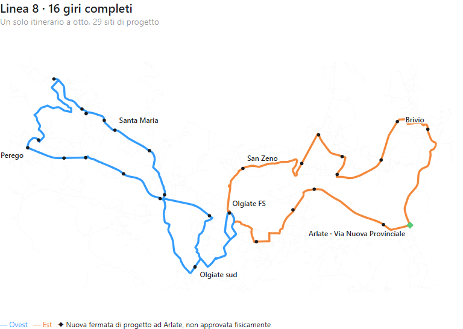

# Linea 8 — proposta istruttoria a 16 giri e verifica delle manovre

## Esito

**È emersa una proposta concreta da validare, non un esercizio già approvato.** Il medesimo otto di 27,679 km viene percorso **16 volte integralmente**, con tutte le 29 identità di sito e le due occorrenze rapide di Olgiate sud e San Zeno. L'orario istruttorio percorre prima l'ala ovest in ogni giro, serve cinque **treni reali consecutivi** per ala e punta con corse H30, ammette un massimo **H70 nelle spalle** e **H120 solo 10–16**. La sosta intermedia a FS è 13,61–18,61 minuti nominali, senza obbligo di cambio. Sono circa **115.143,267 km/anno** su 260 giorni ipotetici, +3,34% su 111.419. Il modello richiede **quattro mezzi nominali** e cinque soltanto nel più severo dei 27 scenari deterministici di marcia/sosta/recupero. H70, quinto mezzo eventuale, calendario e manovre **non sono approvati**.

I treni effettivi abbinati alle cinque corse H30 di punta sono: **ovest → Milano 06:56–08:56**, **est → Milano 07:56–09:56**, **ovest ← Milano 16:32–18:32**, **est ← Milano 17:32–19:32**, ciascun intervallo a passi di 30 minuti. I treni serali sono diretti a Lecco e arrivano da Milano. Nel ricontrollo dell'orario completo risultano compatibili **18 dei 22 precedenti treni-obiettivo**; i quattro non coperti nel controllo sono est→Milano 07:26, ovest→Milano 09:26, est←Milano 16:32 e 17:02. Questi sono abbinamenti deterministici sul GTFS datato, non passeggeri stimati né probabilità di coincidenza. La partenza prima ovest tutela il primo treno delle **06:56 da Olgiate sud** nel modello; il testimone prima est, pur richiedendo quattro mezzi anche nello stress, lascia come prima connessione modellata da Olgiate sud il treno delle **07:56**. La scelta dell'ordine resta istruttoria: non abbiamo domanda disaggregata per giustificare una selezione definitiva.

| Giro completo | FS verso ovest | FS intermedia verso est |
|---:|---|---|
| 1 | 06:00 | 07:00 |
| 2 | 06:30 | 07:30 |
| 3 | 07:00 | 08:00 |
| 4 | 07:30 | 08:30 |
| 5 | 08:00 | 09:00 |
| 6 | 08:55 | 09:50 |
| 7 | 10:05 | 11:00 |
| 8 | 11:50 | 12:50 |
| 9 | 13:30 | 14:25 |
| 10 | 15:30 | 16:25 |
| 11 | 16:40 | 17:35 |
| 12 | 17:10 | 18:05 |
| 13 | 17:40 | 18:35 |
| 14 | 18:10 | 19:05 |
| 15 | 18:40 | 19:35 |
| 16 | 19:40 | 20:35 |

L'ultima corsa continua nell'ala est e rientra a FS intorno alle **21:15 nominali**: non termina alle 19:40. La tabella è un *testimone tecnico*, non un orario al pubblico; i tempi per tutte le occorrenze delle fermate sono nel JSON. Le finestre di garanzia del confronto partono dalle 06:45 per i siti, non sono una promessa di H30 dalle 06:00 in ogni località. Il limite di 70 minuti misura l'attesa della prossima opportunità utile per chi è pronto nelle spalle 06:45–10 e 16–19:40; non significa che ogni intervallo tra due passaggi sia inferiore a 70 minuti. Un intervallo iniziato nella morbida può attraversare il confine delle 16:00: da FS verso ovest, per esempio, le partenze 15:30 e 16:40 distano 70 minuti; verso est, 14:25 e 16:25 distano 120 minuti. L'ultima ripartenza verso est è alle 20:35, ma la garanzia di attesa del confronto termina alle 19:40.

Il test rigoroso H60 nelle spalle, invece di H70, è **infeasible** a 16 giri nel dominio anche scegliendo cinque treni reali consecutivi per ogni ala/punta. Il compromesso H70 non va chiamato H60: richiede l'accettazione esplicita di dieci minuti di margine in alcune fasce. A H70 e prima ovest, il tetto condizionale di quattro mezzi è a sua volta infeasible nei 27 scenari comuni; 26 richiedono quattro e uno cinque. Nessuna di queste conclusioni è una probabilità empirica di ritardo.

## Perché i confronti precedenti sembravano bloccati

La sosta intermedia a Olgiate FS è stata resa variabile per singolo giro completo, **senza creare due linee**. Se i **22 vecchi treni-obiettivo** restano tutti rigidi, non esiste un orario di 16 giri con H60 nelle spalle 06:45/06:50–10 e 16–19:40, H120 10–16 e le cinque corse H30 realmente abbinate per ciascuna ala. Quella prova è valida nel dominio dichiarato, ma non equivale a vietare gruppi diversi di treni reali; la proposta istruttoria sopra nasce proprio dalla verifica di questi ultimi.

Persino sostituendo *a titolo diagnostico* i due treni-obiettivo dell'ala percorsa seconda (07:26 → 09:56 per Milano; 16:32 → 19:02 da Milano), **17 giri non bastano** per H60 nelle spalle. **18 giri** producono un testimone con sosta intermedia breve, ma costano **129.536,175 km/anno** su 260 giorni ipotizzati: **+16,26%** rispetto a 111.419. Non sono autorizzati.

**Solo nel confronto con due treni-obiettivo sostituiti in modo già prefissato**, il miglior limite di spalla trovato a 16 giri è H95: H90 è infeasible e H95 fattibile nelle due precedenze. Quel testimone trattiene però passeggeri a FS fino a 43,61/39,84 minuti nominali. Non è competitivo con la proposta a treni reali e H70 sopra, né approvato.

Un'ulteriore prova individua **perché non basta “mantenere H30” nel nome dell'orario**. Senza imporre i 22 treni-obiettivo originali, l'ordine prima est ammette 16 giri con H30 su entrambe le ali nelle punte, H60 nelle spalle e H120 10–16. Ma massimizzando poi il **numero di obiettivi ferroviari originali effettivamente compatibili**, ne risultano **solo 10 su 22** nel dominio esaminato. Restano scoperti tutti e cinque gli obiettivi mattutini dell'est, il primo dell'ovest e tutti e sei i serali dell'ovest. Nell'ordine prima ovest nemmeno la versione H30 senza ancoraggi ferroviari è fattibile a 16 giri. Il 10/22 è un limite di cardinalità su quei treni datati, **non un punteggio di utilità, una stima di passeggeri o una scelta di quali treni sacrificare**. Non si promuove quindi questo testimone a proposta ferroviaria.

| Test, stesso otto | 16 giri prima ovest | 16 giri prima est |
|---|---|---|
| H60 nelle spalle, H120 solo 10–16, obiettivi originali | Infeasible | Infeasible |
| H60 nelle spalle, due obiettivi sostituiti | Infeasible | Infeasible |
| H90 nelle spalle, due obiettivi sostituiti | Infeasible | Infeasible |
| H95 nelle spalle, due obiettivi sostituiti | Testimone; attesa FS massima 43,61 min | Testimone; attesa FS massima 39,84 min |
| H95, ma sosta intermedia limitata a 80/75 min dalla prima partenza FS | Infeasible | Infeasible |

La sosta indicata nell'ultima riga è un **offset di partenza**, non un'attesa a bordo: nell'ala ovest il tempo nominale di marcia+fermate prima di FS è 41,39 min, nell'est 40,16 min. Almeno un offset di 85/80 min è necessario per il testimone H95 nel rispettivo dominio. Il limite H95 non dichiara una frequenza pubblica uniforme: l'orario proposto dal solutore ha intervalli sino a H120 nella fascia centrale. La minimizzazione della somma degli offset serve solo a evitare attese a bordo inutili a parità di vincoli, non è un peso per selezionare la rete.

## Passaggi utili, non solo nomi delle fermate

Ogni giro del testimone include entrambe le ali nello stesso ordine, la fermata pubblica intermedia a FS e due occorrenze ordinate per **Olgiate sud** e due per **San Zeno/Via Cantù**. Nel modello nominale l'occorrenza iniziale consente il tratto rapido *da FS* (rispettivamente circa 4,32 e 2,54 min); l'ultima il tratto rapido *verso la successiva FS* (circa 4,14 e 2,61 min). L'artefatto registra per ciascuna delle 16 corse l'identificativo, l'ordine e il tempo di ogni evento di fermata. Questi sono tempi modellati e occorrenze di progetto, **non** garanzie di palina fisicamente autorizzata, accessibilità o affidabilità empirica.

I 16 giri mantengono **115.143,267 km/anno** su 260 giorni ipotetici, +3.724,267 km (+3,34%) rispetto al riferimento. Variare le soste non cambia i km di servizio, ma può aumentare il tempo a bordo e il fabbisogno mezzi. Nel testimone H95 con partenza prima est l'indice di sovrapposizione dei giri completi richiede quattro mezzi in tutti i 27 scenari deterministici dichiarati; prima ovest arriva a cinque nello stress più severo. Non sono disponibilità di flotta, turni autista o probabilità di ritardo.

## Manovre della stessa geometria

Il tracciato ancora contiene **sei inversioni immediate** di archi stradali (M1–M6: Hoè/Via Giovanni XXIII; Santa Maria Hoè/Via Como; Olgiate sud/Via Aldo Moro; Via Nazionale est; Calco/Via Nazionale; San Zeno/Via Cesare Cantù). Nessuna è autorizzata per un autobus. Una svolta ammessa dal grafo non equivale a una traiettoria materialmente eseguibile. Servono verifiche d'ingombro del mezzo, accosto e attraversamenti; correggere una manovra può cambiare geometria, km, tempi e quindi l'orario. Lo stato dettagliato e le coordinate sono nel [registro delle manovre](../outputs/phase2/rt031_line8_local_shortcuts_v3/stop_plan_and_additions.json.gz).

## Dominio e decisione

**Aggiornamento sulle manovre:** la [verifica delle alternative stradali](RT031_LINEA8_MANOVRE_ALTERNATIVE_STRADALI_V3.md) trova cinque ritorni senza inversioni immediate; M5 Calco–Via Nazionale rimane irrisolta. Inserire tutte le cinque alternative porterebbe a 126.611 km/anno e richiederebbe un ritocco della garanzia di attesa a San Zeno. Queste geometrie non sono adottate: i 115.143 km sopra continuano a riferirsi al percorso originale, condizionato alla verifica fisica delle sei manovre.

Partenze della prima FS 05:00–19:40 a passi di cinque minuti; sette possibili offset di ripartenza dalla FS intermedia per ogni giro, dal primo stress-fattibile a +30 minuti; stessi 29 siti e stessa sequenza stradale in tutte le corse di ciascun test; nove scenari comuni di marcia/sosta; H30 sui cinque eventi realmente abbinati ai treni centrali in ciascuna ala. I test H95 e H60 con due treni sostituiti non conservano tutti i 22 obiettivi ferroviari *originali*. Il modello non certifica ritardi indipendenti, manovre, paline, continuità fisica dei passeggeri o un esercizio completo.

**Conclusione operativa:** l'orario prima ovest H70/16 giri è la **singola proposta istruttoria da portare a verifica tecnica**: rispetta la linea unica, i passaggi locali utili, le punte H30 agganciate a treni veri e uno scostamento chilometrico contenuto. Non soddisfa l'H60 esatto nelle spalle e non è esercibile dichiarativamente senza validare sei manovre, paline/attraversamenti, tempi osservati, mezzo stress e calendario. Serve l'accettazione esplicita del compromesso H70; fino ad allora `network_selected=false`, `primary_selection_authorised=false`, `runner_up_selection_authorised=false`.

[Risultati machine-readable, orari ed eventi ordinati (JSON gzip)](../outputs/phase2/rt031_line8_local_shortcuts_v3/variable_fs_hold_16_full_trips.json.gz) · [Script riproducibile](../scripts/phase2_probe_rt031_line8_variable_fs_hold_v3.py) · [Audit precedente a sosta fissa](RT031_LINEA8_16_GIRI_COMPLETI_V3.md)
