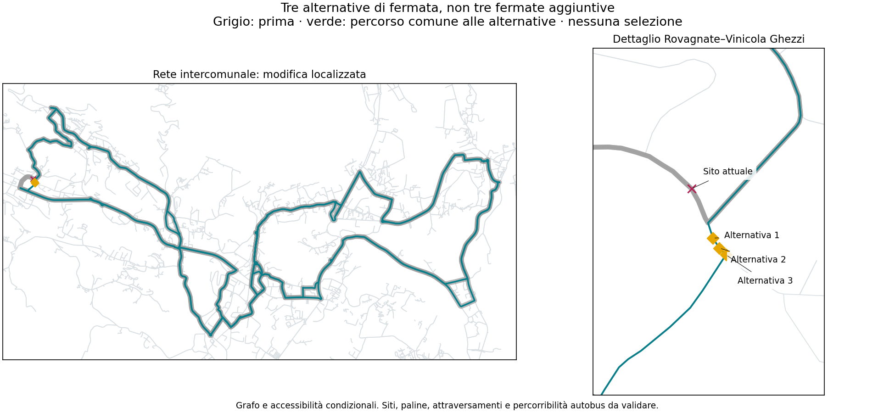

# Linea 8 — fermate spostate sulle scorciatoie: primo confronto

**281 punti stradali nuovi, 709 casi strada/fermate/copertura.** Sono stati analizzati tutti i nodi condivisi dai due versi sulle deviazioni ereditate, esclusi quelli già serviti da un sito d’inventario. Il primo conteggio era 282: un nodo era già servito e non è stato presentato come nuova fermata.

## Esito verificato

**Una piccola correzione senza perdita dei nuclei già coperti esiste, ma non risolve il budget né i viaggi lunghi.** Tre posizioni alternative presso Rovagnate–Vinicola Ghezzi permettono di sostituire il sito attuale con uno nuovo sulla scorciatoia. Non sono tre fermate da aggiungere: sono tre alternative non autorizzate.

- Restano 28 identità di sito compresa FS, ma una è sostituita: `FROZEN::300879` non è più servita.
- Nessun nucleo già entro 5, 8 o 10 minuti perde quella copertura nel modello pedonale; tutte le 15 metriche dei cinque comuni sono non peggiori.
- Risparmio stradale: **33,19 metri per corsa ovest**, circa **66,38 metri sommando un giro A e un giro B**.
- I tempi nominali sul bus dei siti conservati possono aumentare fino a circa **3 secondi**: meno metri non garantiscono meno tempo nel modello stradale.

## Orario ricalcolato, non moltiplicazione dei metri a priori

| Confronto fino alle 19:40 | Prima | Dopo lo spostamento | Risparmio annuo |
|---|---:|---:|---:|
| H30 in punta / H60 nel resto | 143.929 km | 143.756 km | 173 km |
| H30 in punta / H90 nel resto. non approvato | 122.340 km | 122.193 km | 147 km |

Tutte e tre le posizioni sono state ricalcolate in entrambi i confronti: sei ottimi nel dominio finito. Il riferimento resta **111.419 km**; il caso H60 rimane circa 32.337 km sopra, prima di deposito e riposizionamenti. Quattro mezzi nominali; nei testimoni fino a sei nella griglia di stress, non una prova di fabbisogno minimo di riserva.

Sono mantenuti calendario ipotetico a 260 giorni, punte comuni 06:50–08:50 e 16:35–18:35, treni congelati al 3 settembre 2026 e lo stesso limite di attesa AM del riferimento. L’ultimo obiettivo PM è 19:32; il precedente 20:32 resta escluso da questa fascia. H90, le fasi e la fascia non sono approvati automaticamente. Non è un orario pubblico certificato.

## Gli altri casi non sono stati scartati imponendo perdita zero

Il controllo senza perdite è un gruppo diagnostico, **non un nuovo vincolo politico**. Tutti i 709 casi sono conservati. La frontiera preliminare senza pesi comprende 165 casi; considera separatamente metri per verso, copertura, residenti precedentemente coperti che perdono accesso, identità mantenute e tempi di viaggio. Non è una frontiera di esercizio: i casi con perdite territoriali non hanno ancora un nuovo orario validato.

Alcuni limiti misurati delle scorciatoie più grandi:

| Sito da sostituire / deviazione | Risparmio sommando i due versi | Comune esaminato | Perdita minima di popolazione prima coperta a 10 min, punti percentuali |
|---|---:|---|---:|
| Calco–Via Virgilio | 1.397 km | Calco | 16.7154 pp |
| Arlate–Cantina Pirovano | 2.587 km | Calco | 12.0824 pp |
| Hoè | 2.632 km | Santa Maria Hoe | 2.3237 pp |
| Beverate–Quattro Strade | 0.529 km | Brivio | 0.0063 pp |

La colonna finale è un **limite inferiore della perdita** tra tutte le posizioni provate per quella deviazione, non la scelta di un candidato e non una soglia accettabile. Non comprende le ulteriori perdite possibili a 5 e 8 minuti o i cambi di tempo sul bus. Per Beverate il saldo comunale a 10 minuti può perfino migliorare, ma alcuni nuclei prima coperti restano esclusi: saldo netto e persone perse non sono la stessa cosa.

## Mappa e limiti

La mappa illustra le tre alternative senza perdita, non seleziona una proposta. Olgiate sud e San Zeno rimangono esigenze distinte e presenti. Le coordinate sono nodi del grafo, **non punti di salita sicuri o autorizzati**. I collegamenti pedonali usano lo stesso modello e gli stessi connettori del riferimento; non equivalgono a sopralluoghi.

Il dominio resta circoscritto: una sola ala modificata alla volta, omissione di uno o due siti consecutivi dall’ordine richiesto, al massimo una fermata alternativa su ciascuna scorciatoia già generata. Non sono state cercate tutte le combinazioni di modifiche, tutti gli ordini delle fermate o tutte le posizioni lungo le strade. Le restrizioni stradali dipendenti dall’intera storia del percorso e l’idoneità autobus restano non certificate.

[709 casi e risultati pedonali](../outputs/phase2/rt031_line8_local_shortcuts_v3/stop_relocation_screen.json) · [Frontiera preliminare senza pesi](../outputs/phase2/rt031_line8_local_shortcuts_v3/stop_relocation_frontier.json) · [Sei orari ricalcolati](../outputs/phase2/rt031_line8_local_shortcuts_v3/stop_relocation_timetable.json) · [Tracciato GeoJSON delle alternative illustrate](../outputs/phase2/rt031_line8_local_shortcuts_v3/stop_relocation_diagnostic.geojson)

**Non possiamo attribuire a questo piccolo spostamento il raggiungimento dei 111 mila km.** I casi che risparmiano di più presentano rinunce territoriali esplicite; servono confronto operativo e accettazione del compromesso, non una selezione automatica.
